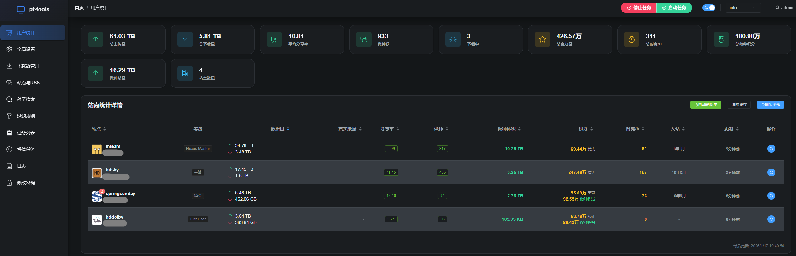
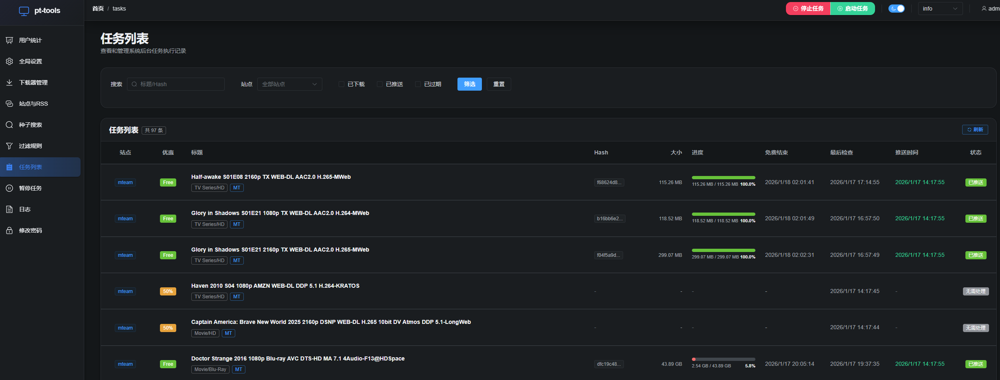

# pt-tools

[](https://go.dev/)
[](LICENSE)
[](https://hub.docker.com/r/sunerpy/pt-tools)

`pt-tools` 是一个功能强大的 PT（Private Tracker）站点自动化管理工具，提供 RSS 订阅自动下载、多站点种子搜索、用户信息统计、下载器管理等功能，帮助用户高效管理多个 PT 站点。



<details>
<summary>点击查看任务列表示例 (Click to view Task List Screenshot)</summary>



</details>

## 功能特性

| 功能                 | 描述                                                              |
| -------------------- | ----------------------------------------------------------------- |
| **RSS 自动订阅**     | 自动解析 RSS 订阅，智能识别免费种子并自动下载推送                 |
| **多站点种子搜索**   | 跨站点搜索，支持批量下载和批量推送到下载器,或者下载种子文件到本地 |
| **用户信息统计**     | 聚合展示所有站点的上传量、下载量、分享率、魔力值、等级进度等      |
| **数据截图分享**     | 一键生成用户数据卡片截图，支持导出分享到社交平台                  |
| **下载器管理**       | 支持多个下载器实例，可配置不同的下载目录和启动策略                |
| **过滤规则**         | 对 RSS 订阅进行精细化筛选，支持关键词/通配符/正则表达式           |
| **免费结束自动暂停** | 监控种子免费状态，免费期结束时自动暂停未完成的下载任务            |
| **免费结束自动删除** | 可选开启，免费期结束时自动删除未完成的种子及数据，无需手动操作    |
| **自动删种**         | 按做种时间/分享率/不活跃时间自动清理种子，支持 H&R 保护和磁盘保底 |
| **代理支持**         | 支持 HTTP_PROXY/HTTPS_PROXY/ALL_PROXY/NO_PROXY 环境变量代理       |
| **版本更新检查**     | 自动检测新版本，支持代理设置，在 Web 界面展示更新日志             |
| **一键自动升级**     | 二进制部署支持 Web 界面一键升级，自动下载替换，无需手动操作       |
| **Web 管理界面**     | Web UI 管理后台，方便配置和监控                                   |

> [!WARNING]
> **关于 RSS 订阅与过滤规则**：在未启用任何过滤规则的情况下，RSS 订阅**默认只会下载免费种子**。如果您只是刷流，无需设置过滤规则，直接添加 RSS 订阅即可。只有在需要追剧或下载特定资源（即便种子非免费也要下载）时，才需要创建过滤规则并关闭规则中的「仅免费」开关。

### 数据截图分享

在用户信息页面，支持将站点数据生成精美的卡片截图，方便分享到社交平台或群组。

**功能特点**：

- **一键截图**：点击按钮即可生成当前数据的截图
- **卡片样式**：精心设计的卡片布局，展示上传量、下载量、分享率等关键数据
- **隐私保护**：自动隐藏敏感信息（如用户名、站点地址等）
- **导出保存**：支持导出为 PNG 图片保存到本地

### 免费结束自动暂停

针对 PT 站点免费种子的智能管理功能，帮助用户在免费期结束前避免产生不必要的下载量消耗。

**工作原理**：

1. RSS 订阅下载免费种子时，系统自动记录种子的免费结束时间
2. 为每个种子创建独立定时器，在免费结束时刻精确触发检查
3. 免费期结束时，自动检测下载进度，暂停未完成的任务
4. 已完成的种子不受影响，继续正常做种

**功能特点**：

- **精确定时**：独立定时器 + 周期检查双重机制，支持应用重启后自动恢复监控
- **智能判断**：仅暂停未完成任务，已完成任务继续做种
- **手动恢复**：支持在 Web 界面手动恢复暂停的任务（不再受免费限制）
- **批量管理**：支持批量删除暂停任务，可选是否同时删除数据文件
- **历史归档**：查看历史暂停记录和处理结果
- **自动删除**：可在系统设置中开启「免费结束自动删除」，免费期结束时自动删除未完成的种子及数据文件，无需手动操作

**启用方式**：在添加或编辑 RSS 订阅时，开启「免费结束时暂停」开关即可。

> [!TIP]
> 默认行为为暂停，如需自动删除，请在「系统设置 → 免费结束管理」中开启「免费结束自动删除」开关。此功能默认关闭，需用户手动开启并保存。

### 一键自动升级

针对二进制部署用户的便捷升级功能，无需手动下载替换文件，在 Web 界面即可完成版本升级。

**支持环境**：

| 部署方式    | 支持情况        | 说明                                               |
| ----------- | --------------- | -------------------------------------------------- |
| 二进制部署  | ✅ 完全支持     | 自动下载、解压、替换二进制文件                     |
| Docker 部署 | ⚠️ 需第三方工具 | 推荐使用 Watchtower 自动更新，或手动 `docker pull` |

**升级流程**：

1. 在 Web 界面右上角点击版本号，查看可用更新
2. 选择目标版本，点击「升级」按钮
3. 系统自动下载对应平台的安装包并替换当前程序
4. 升级完成后，手动重启服务即可使用新版本

**Docker 用户升级方式**：

```bash
# 拉取最新镜像
docker pull sunerpy/pt-tools:latest

# 重启容器
docker restart pt-tools
```

或使用 Docker Compose：

```bash
docker compose pull
docker compose up -d
```

**自动更新方案**：推荐使用 [Watchtower](https://github.com/containrrr/watchtower) 实现 Docker 容器自动更新：

```bash
docker run -d \
  --name watchtower \
  -v /var/run/docker.sock:/var/run/docker.sock \
  containrrr/watchtower \
  --cleanup \
  pt-tools
```

Watchtower 会自动检测并更新 pt-tools 容器到最新版本。

## 支持站点

[已适配站点列表](docs/sites.md)

> **扩展站点支持**：如需支持其他站点，欢迎提交 [Issue](https://github.com/sunerpy/pt-tools/issues) 或 [Pull Request](https://github.com/sunerpy/pt-tools/pulls)。

## 快速开始

### Docker 部署（推荐）

镜像地址：[Docker Hub](https://hub.docker.com/r/sunerpy/pt-tools)

```bash
docker run -d \
  --name pt-tools \
  -p 8080:8080 \
  -v ~/pt-data:/app/.pt-tools \
  -e PT_HOST=0.0.0.0 \
  -e PT_PORT=8080 \
  -e TZ=Asia/Shanghai \
  sunerpy/pt-tools:latest
```

### Docker Compose（推荐）

```yaml
services:
  pt-tools:
    image: sunerpy/pt-tools:latest
    container_name: pt-tools
    environment:
      PT_HOST: "0.0.0.0"
      PT_PORT: "8080"
      TZ: "Asia/Shanghai"
    ports:
      - "8080:8080"
    volumes:
      - ./data:/app/.pt-tools
    restart: unless-stopped
```

> 如需通过代理访问站点，可设置环境变量：`HTTP_PROXY`、`HTTPS_PROXY`、`ALL_PROXY`、`NO_PROXY`。
> 详细说明见 [docs/configuration.md](docs/configuration.md#代理配置)。

启动后访问 `http://localhost:8080` 进入 Web 管理界面。

**默认登录账号**：`admin` / `adminadmin`

> 更多部署示例请参考：
>
> - [examples/docker-run.md](examples/docker-run.md) - Docker 单容器运行详解
> - [examples/docker-compose.yml](examples/docker-compose.yml) - Docker Compose 编排
> - [examples/binary-run.md](examples/binary-run.md) - 二进制运行和 systemd 配置

### 二进制运行

前往 [Releases 页面](https://github.com/sunerpy/pt-tools/releases) 下载预编译二进制文件。

**Linux**：

```bash
wget https://github.com/sunerpy/pt-tools/releases/latest/download/pt-tools-linux-amd64.tar.gz
tar -xzf pt-tools-linux-amd64.tar.gz
chmod +x pt-tools
./pt-tools web --host 0.0.0.0 --port 8080
```

**Windows (PowerShell)**：

```powershell
# 一键下载、解压并运行（复制整段命令到 PowerShell 执行）
Invoke-WebRequest -Uri "https://github.com/sunerpy/pt-tools/releases/latest/download/pt-tools-windows-amd64.exe.zip" -OutFile "pt-tools.zip"; Expand-Archive -Path "pt-tools.zip" -DestinationPath "." -Force; .\pt-tools.exe web --host 0.0.0.0 --port 8080
```

或分步执行：

```powershell
# 下载并解压
Invoke-WebRequest -Uri "https://github.com/sunerpy/pt-tools/releases/latest/download/pt-tools-windows-amd64.exe.zip" -OutFile "pt-tools.zip"
Expand-Archive -Path "pt-tools.zip" -DestinationPath "."

# 运行
.\pt-tools.exe web --host 0.0.0.0 --port 8080
```

> **注意**：这是一个命令行工具，双击 exe 文件会提示需要在命令行中运行。请使用上述 PowerShell 命令启动服务。

| 系统    | 架构  | 文件名                           |
| ------- | ----- | -------------------------------- |
| Linux   | amd64 | `pt-tools-linux-amd64.tar.gz`    |
| Linux   | arm64 | `pt-tools-linux-arm64.tar.gz`    |
| Windows | amd64 | `pt-tools-windows-amd64.exe.zip` |
| Windows | arm64 | `pt-tools-windows-arm64.exe.zip` |

## 使用指南

### 初次配置流程

1. **启动服务**：使用 Docker 或二进制启动 pt-tools
2. **登录管理界面**：访问 `http://localhost:8080`，使用默认账号 `admin` / `adminadmin` 登录
3. **修改密码**：首次登录后建议修改默认密码
4. **配置下载器**：添加 qBittorrent 或 Transmission
5. **配置站点认证**（二选一）：
   - **推荐**：安装 [PT Tools Helper 浏览器扩展](#浏览器扩展)，在 PT 站点登录后一键同步 Cookie
   - 手动方式：参考 [获取 Cookie / API Key](docs/guide/get-cookie-apikey.md) 手动复制粘贴
6. **配置 RSS 订阅**：添加 RSS 订阅实现自动下载
7. **配置过滤规则**（可选）：创建过滤规则实现精准下载

## 浏览器扩展

**PT Tools Helper** 是 pt-tools 的配套浏览器扩展，支持 Chrome 和 Edge。

| 功能                 | 说明                                                          |
| -------------------- | ------------------------------------------------------------- |
| **Cookie 自动同步**  | 在 PT 站点登录后，一键将 Cookie 同步到 pt-tools，无需手动复制 |
| **批量同步**         | 在扩展设置中勾选多个站点，一键批量同步所有 Cookie             |
| **一键采集站点数据** | 自动抓取种子列表页、详情页、用户信息页，用于请求适配新站点    |
| **自动脱敏**         | 采集的页面数据自动移除 Passkey、邮箱、IP 等敏感信息           |
| **导出 & 提交**      | 将采集数据导出为 ZIP，或一键创建 GitHub Issue 请求新站点支持  |
| **中英文支持**       | 自动跟随浏览器语言切换中文/英文界面                           |

### 安装方式

**从 GitHub Release 下载**（推荐）：

1. 前往 [Releases](https://github.com/sunerpy/pt-tools/releases) 下载最新的 `pt-tools-helper.zip`
2. 解压到任意目录
3. Chrome → `chrome://extensions` / Edge → `edge://extensions`
4. 开启「开发者模式」→「加载已解压的扩展程序」→ 选择解压目录

**Edge Add-ons 扩展商店**（审核中）：

- 审核通过后可在 Edge 扩展商店搜索 "PT Tools Helper" 直接安装

详细使用说明见 [扩展 README](tools/browser-extension/README.md)。

## 文档

| 文档                                                           | 说明                                   |
| -------------------------------------------------------------- | -------------------------------------- |
| **[获取 Cookie / API Key](docs/guide/get-cookie-apikey.md)**   | 详细介绍如何从各站点获取认证信息       |
| **[浏览器扩展使用指南](tools/browser-extension/README.md)**    | 自动同步 Cookie、采集站点数据          |
| **[RSS 订阅配置指南](docs/guide/rss-subscription.md)**         | 如何配置 RSS 订阅实现自动下载          |
| **[过滤规则与追剧指南](docs/guide/filter-rules-tv-series.md)** | 使用过滤规则自动追剧、筛选资源         |
| **[自动删种指南](docs/guide/auto-cleanup.md)**                 | 自动清理种子策略配置和 H&R 保护        |
| **[请求新增站点支持](docs/guide/request-new-site.md)**         | 无需编程经验，提供页面数据即可请求适配 |
| **[配置说明](docs/configuration.md)**                          | 环境变量、全局设置、下载器配置详解     |
| **[常见问题 (FAQ)](docs/faq.md)**                              | 常见问题和解决方案                     |
| **[开发指南](docs/development.md)**                            | 从源码构建、技术架构、贡献指南         |

## 贡献

欢迎贡献代码或提交问题！

- **提交 Issue**：[GitHub Issues](https://github.com/sunerpy/pt-tools/issues)
- **提交 PR**：[GitHub Pull Requests](https://github.com/sunerpy/pt-tools/pulls)
- **交流群**：[Telegram](https://t.me/+7YK2kmWIX0s1Nzdl)

详细的贡献流程请参考 [开发指南](docs/development.md)。

## 更新日志

查看 [Releases](https://github.com/sunerpy/pt-tools/releases) 获取完整更新日志。

## 许可证

[MIT License](LICENSE)

## Star History

如果这个项目对你有帮助，请给一个 Star 支持一下！

[](https://star-history.com/#sunerpy/pt-tools&Date)

## 交流分享

<table>
  <tr>
    <td align="center">
      <a href="https://t.me/+7YK2kmWIX0s1Nzdl">Telegram</a><br>
      
    </td>
    <td align="center">
      QQ群: 274984594<br>
      
    </td>
  </tr>
</table>

---

**免责声明**：本工具仅供学习和研究使用，请遵守各 PT 站点的规则，合理使用。
