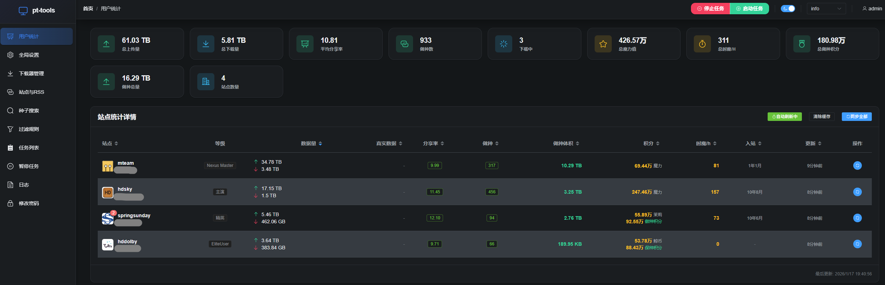
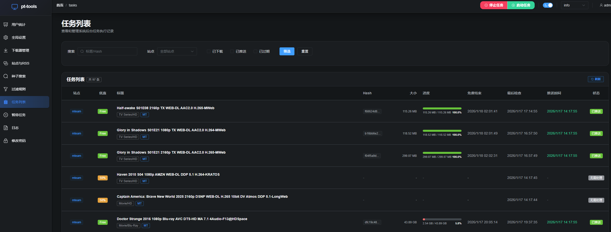

# pt-tools

[](https://go.dev/)
[](LICENSE)
[](https://hub.docker.com/r/sunerpy/pt-tools)

`pt-tools` 是一个功能强大的 PT（Private Tracker）站点自动化管理工具，提供 RSS 订阅自动下载、多站点种子搜索、用户信息统计、下载器管理等功能，帮助用户高效管理多个 PT 站点。



<details>
<summary>点击查看任务列表示例 (Click to view Task List Screenshot)</summary>



</details>

## 🤖 ChatOps & 机器人（v0.31+）

pt-tools 现支持通过 **QQ** 或 **Telegram** 机器人远程管理：

- 🇨🇳 **QQ OneBot** via [NapCat](https://github.com/NapNeko/NapCatQQ)（reverse-WebSocket，私聊命令，已端到端验证）
- 🌍 **Telegram Bot** via [BotFather](https://t.me/BotFather)（long-poll，私聊命令，支持代理，已端到端验证）
- 🛠️ 内置 11 个命令：`/help` `/status` `/version` `/tasks` `/sites` `/torrents` `/pause` `/resume` `/delete` `/bind` `/unbind`
- 📡 **RSS 上新通知**：QQ/Telegram 推送站点新种，支持全量/规则匹配双模式 + 静默时段 + digest 合并
- 🔐 安全：管理员白名单、绑定码 TTL（5min/1h/1d/30d/永久）、AES-GCM 加密落库、HMAC 签名 webhook、操作审计日志

> **实验性出站通道（暂未端到端验证）**：企业微信群机器人 / 自定义 Webhook（HMAC-SHA256）— 代码已实现，欢迎贡献测试反馈。

详见：

- [快速开始 → ChatOps](docs/guide/chatops-quickstart.md)
- [QQ OneBot (NapCat) 配置](docs/guide/chatops-qq-napcat.md)
- [Telegram Bot 配置](docs/guide/chatops-telegram.md)
- [RSS 上新通知](docs/guide/chatops-rss-notify.md)

---

## 功能特性

| 功能                 | 描述                                                              |
| -------------------- | ----------------------------------------------------------------- |
| **RSS 自动订阅**     | 自动解析 RSS 订阅，智能识别免费种子并自动下载推送                 |
| **多站点种子搜索**   | 跨站点搜索，支持批量下载和批量推送到下载器,或者下载种子文件到本地 |
| **用户信息统计**     | 聚合展示所有站点的上传量、下载量、分享率、魔力值、等级进度等      |
| **数据截图分享**     | 一键生成用户数据卡片截图，支持导出分享到社交平台                  |
| **下载器管理**       | 支持多个下载器实例，可配置不同的下载目录和启动策略                |
| **过滤规则**         | 对 RSS 订阅进行精细化筛选，支持关键词/通配符/正则表达式           |
| **免费结束自动暂停** | 监控种子免费状态，免费期结束时自动暂停未完成的下载任务            |
| **免费结束自动删除** | 可选开启，免费期结束时自动删除未完成的种子及数据，无需手动操作    |
| **自动删种**         | 按做种时间/分享率/不活跃时间自动清理种子，支持 H&R 保护和磁盘保底 |
| **代理支持**         | 支持 HTTP_PROXY/HTTPS_PROXY/ALL_PROXY/NO_PROXY 环境变量代理       |
| **版本更新检查**     | 自动检测新版本，支持代理设置，在 Web 界面展示更新日志             |
| **一键自动升级**     | 二进制部署支持 Web 界面一键升级，自动下载替换，无需手动操作       |
| **Web 管理界面**     | Web UI 管理后台，方便配置和监控                                   |

> [!WARNING]
> **关于 RSS 订阅与过滤规则**：在未启用任何过滤规则的情况下，RSS 订阅**默认只会下载免费种子**。如果您只是刷流，无需设置过滤规则，直接添加 RSS 订阅即可。只有在需要追剧或下载特定资源（即便种子非免费也要下载）时，才需要创建过滤规则并关闭规则中的「仅免费」开关。

### 数据截图分享

在用户信息页面，支持将站点数据生成精美的卡片截图，方便分享到社交平台或群组。

**功能特点**：

- **一键截图**：点击按钮即可生成当前数据的截图
- **卡片样式**：精心设计的卡片布局，展示上传量、下载量、分享率等关键数据
- **隐私保护**：自动隐藏敏感信息（如用户名、站点地址等）
- **导出保存**：支持导出为 PNG 图片保存到本地

### 免费结束自动暂停

针对 PT 站点免费种子的智能管理功能，帮助用户在免费期结束前避免产生不必要的下载量消耗。

**工作原理**：

1. RSS 订阅下载免费种子时，系统自动记录种子的免费结束时间
2. 为每个种子创建独立定时器，在免费结束时刻精确触发检查
3. 免费期结束时，自动检测下载进度，暂停未完成的任务
4. 已完成的种子不受影响，继续正常做种

**功能特点**：

- **精确定时**：独立定时器 + 周期检查双重机制，支持应用重启后自动恢复监控
- **智能判断**：仅暂停未完成任务，已完成任务继续做种
- **手动恢复**：支持在 Web 界面手动恢复暂停的任务（不再受免费限制）
- **批量管理**：支持批量删除暂停任务，可选是否同时删除数据文件
- **历史归档**：查看历史暂停记录和处理结果
- **自动删除**：可在系统设置中开启「免费结束自动删除」，免费期结束时自动删除未完成的种子及数据文件，无需手动操作

**启用方式**：在添加或编辑 RSS 订阅时，开启「免费结束时暂停」开关即可。

> [!TIP]
> 默认行为为暂停，如需自动删除，请在「系统设置 → 免费结束管理」中开启「免费结束自动删除」开关。此功能默认关闭，需用户手动开启并保存。

### 一键自动升级

针对二进制部署用户的便捷升级功能，无需手动下载替换文件，在 Web 界面即可完成版本升级。

**支持环境**：

| 部署方式    | 支持情况        | 说明                                               |
| ----------- | --------------- | -------------------------------------------------- |
| 二进制部署  | ✅ 完全支持     | 自动下载、解压、替换二进制文件                     |
| Docker 部署 | ⚠️ 需第三方工具 | 推荐使用 Watchtower 自动更新，或手动 `docker pull` |

**升级流程**：

1. 在 Web 界面右上角点击版本号，查看可用更新
2. 选择目标版本，点击「升级」按钮
3. 系统自动下载对应平台的安装包并替换当前程序
4. 升级完成后，手动重启服务即可使用新版本

**Docker 用户升级方式**：

```bash
# 拉取最新镜像
docker pull sunerpy/pt-tools:latest

# 重启容器
docker restart pt-tools
```

或使用 Docker Compose：

```bash
docker compose pull
docker compose up -d
```

**自动更新方案**：推荐使用 [Watchtower](https://github.com/containrrr/watchtower) 实现 Docker 容器自动更新：

```bash
docker run -d \
  --name watchtower \
  -v /var/run/docker.sock:/var/run/docker.sock \
  containrrr/watchtower \
  --cleanup \
  pt-tools
```

Watchtower 会自动检测并更新 pt-tools 容器到最新版本。

## 支持站点

[已适配站点列表](docs/sites.md)

> **扩展站点支持**：如需支持其他站点，欢迎提交 [Issue](https://github.com/sunerpy/pt-tools/issues) 或 [Pull Request](https://github.com/sunerpy/pt-tools/pulls)。

## 快速开始

### Docker 部署（推荐）

镜像地址：[Docker Hub](https://hub.docker.com/r/sunerpy/pt-tools)

```bash
docker run -d \
  --name pt-tools \
  -p 8080:8080 \
  -v ~/pt-data:/app/.pt-tools \
  -e PT_HOST=0.0.0.0 \
  -e PT_PORT=8080 \
  -e TZ=Asia/Shanghai \
  sunerpy/pt-tools:latest
```

### Docker Compose（推荐）

```yaml
services:
  pt-tools:
    image: sunerpy/pt-tools:latest
    container_name: pt-tools
    environment:
      PT_HOST: "0.0.0.0"
      PT_PORT: "8080"
      TZ: "Asia/Shanghai"
    ports:
      - "8080:8080"
    volumes:
      - ./data:/app/.pt-tools
    restart: unless-stopped
```

> 如需通过代理访问站点，可设置环境变量：`HTTP_PROXY`、`HTTPS_PROXY`、`ALL_PROXY`、`NO_PROXY`。
> 详细说明见 [docs/configuration.md](docs/configuration.md#代理配置)。

启动后访问 `http://localhost:8080` 进入 Web 管理界面。

**默认登录账号**：`admin` / `adminadmin`

> 更多部署示例请参考：
>
> - [examples/docker-run.md](examples/docker-run.md) - Docker 单容器运行详解
> - [examples/docker-compose.yml](examples/docker-compose.yml) - Docker Compose 编排
> - [examples/binary-run.md](examples/binary-run.md) - 二进制运行和 systemd 配置

### 二进制运行

前往 [Releases 页面](https://github.com/sunerpy/pt-tools/releases) 下载预编译二进制文件。

**Linux**：

```bash
wget https://github.com/sunerpy/pt-tools/releases/latest/download/pt-tools-linux-amd64.tar.gz
tar -xzf pt-tools-linux-amd64.tar.gz
chmod +x pt-tools
./pt-tools web --host 0.0.0.0 --port 8080
```

**Windows (PowerShell)**：

```powershell
# 一键下载、解压并运行（复制整段命令到 PowerShell 执行）
Invoke-WebRequest -Uri "https://github.com/sunerpy/pt-tools/releases/latest/download/pt-tools-windows-amd64.exe.zip" -OutFile "pt-tools.zip"; Expand-Archive -Path "pt-tools.zip" -DestinationPath "." -Force; .\pt-tools.exe web --host 0.0.0.0 --port 8080
```

或分步执行：

```powershell
# 下载并解压
Invoke-WebRequest -Uri "https://github.com/sunerpy/pt-tools/releases/latest/download/pt-tools-windows-amd64.exe.zip" -OutFile "pt-tools.zip"
Expand-Archive -Path "pt-tools.zip" -DestinationPath "."

# 运行
.\pt-tools.exe web --host 0.0.0.0 --port 8080
```

> **注意**：这是一个命令行工具，双击 exe 文件会提示需要在命令行中运行。请使用上述 PowerShell 命令启动服务。

| 系统    | 架构  | 文件名                           |
| ------- | ----- | -------------------------------- |
| Linux   | amd64 | `pt-tools-linux-amd64.tar.gz`    |
| Linux   | arm64 | `pt-tools-linux-arm64.tar.gz`    |
| Windows | amd64 | `pt-tools-windows-amd64.exe.zip` |
| Windows | arm64 | `pt-tools-windows-arm64.exe.zip` |

## 使用指南

### 初次配置流程

1. **启动服务**：使用 Docker 或二进制启动 pt-tools
2. **登录管理界面**：访问 `http://localhost:8080`，使用默认账号 `admin` / `adminadmin` 登录
3. **修改密码**：首次登录后建议修改默认密码
4. **配置下载器**：添加 qBittorrent 或 Transmission
5. **配置站点认证**（二选一）：
   - **推荐**：安装 [PT Tools Helper 浏览器扩展](#浏览器扩展)，在 PT 站点登录后一键同步 Cookie
   - 手动方式：参考 [获取 Cookie / API Key](docs/guide/get-cookie-apikey.md) 手动复制粘贴
6. **配置 RSS 订阅**：添加 RSS 订阅实现自动下载
7. **配置过滤规则**（可选）：创建过滤规则实现精准下载

## 浏览器扩展

**PT Tools Helper** 是 pt-tools 的配套浏览器扩展，支持 Chrome 和 Edge。

| 功能                 | 说明                                                          |
| -------------------- | ------------------------------------------------------------- |
| **Cookie 自动同步**  | 在 PT 站点登录后，一键将 Cookie 同步到 pt-tools，无需手动复制 |
| **批量同步**         | 在扩展设置中勾选多个站点，一键批量同步所有 Cookie             |
| **一键采集站点数据** | 自动抓取种子列表页、详情页、用户信息页，用于请求适配新站点    |
| **自动脱敏**         | 采集的页面数据自动移除 Passkey、邮箱、IP 等敏感信息           |
| **导出 & 提交**      | 将采集数据导出为 ZIP，或一键创建 GitHub Issue 请求新站点支持  |
| **中英文支持**       | 自动跟随浏览器语言切换中文/英文界面                           |

### 安装方式

**Edge Add-ons 扩展商店**（推荐）：

- 前往 [Edge 扩展商店](https://microsoftedge.microsoft.com/addons/detail/pt-tools-helper/pgicnjkmgenmjfhlclodbpbedjmojbea) 搜索 "PT Tools Helper" 直接安装，支持自动更新

**从 GitHub Release 手动安装**：

1. 前往 [Releases](https://github.com/sunerpy/pt-tools/releases) 下载最新的 `pt-tools-helper.zip`
2. 解压到任意目录
3. Chrome → `chrome://extensions` / Edge → `edge://extensions`
4. 开启「开发者模式」→「加载已解压的扩展程序」→ 选择解压目录

**直接安装签名版 `.crx`**：从 [Releases](https://github.com/sunerpy/pt-tools/releases) 下载 `pt-tools-helper.crx`，拖入 `chrome://extensions/`（需开启「开发者模式」）。注意 Chrome 现在默认禁止 `.crx` 直接安装，浏览器可能会提示已停用；如不可用，请改用上面的 zip + 加载已解压扩展程序方式。

详细使用说明见 [扩展 README](tools/browser-extension/README.md)。

## 文档

| 文档                                                           | 说明                                         |
| -------------------------------------------------------------- | -------------------------------------------- |
| **[ChatOps 快速开始](docs/guide/chatops-quickstart.md)**       | 机器人功能概览、通道选择与命令清单           |
| **[QQ OneBot (NapCat) 配置](docs/guide/chatops-qq-napcat.md)** | NapCat Docker 部署、反向 WS 配置、绑定测试   |
| **[Telegram Bot 配置](docs/guide/chatops-telegram.md)**        | BotFather 创建 bot、代理配置、绑定测试       |
| **[RSS 上新通知](docs/guide/chatops-rss-notify.md)**           | RSS 新种实时推送：双模式、静默、digest、按钮 |
| **[获取 Cookie / API Key](docs/guide/get-cookie-apikey.md)**   | 详细介绍如何从各站点获取认证信息             |
| **[浏览器扩展使用指南](tools/browser-extension/README.md)**    | 自动同步 Cookie、采集站点数据                |
| **[RSS 订阅配置指南](docs/guide/rss-subscription.md)**         | 如何配置 RSS 订阅实现自动下载                |
| **[过滤规则与追剧指南](docs/guide/filter-rules-tv-series.md)** | 使用过滤规则自动追剧、筛选资源               |
| **[自动删种指南](docs/guide/auto-cleanup.md)**                 | 自动清理种子策略配置和 H&R 保护              |
| **[请求新增站点支持](docs/guide/request-new-site.md)**         | 无需编程经验，提供页面数据即可请求适配       |
| **[配置说明](docs/configuration.md)**                          | 环境变量、全局设置、下载器配置详解           |
| **[常见问题 (FAQ)](docs/faq.md)**                              | 常见问题和解决方案                           |
| **[开发指南](docs/development.md)**                            | 从源码构建、技术架构、贡献指南               |

## 站点登录管理（防封号）

通过浏览器扩展 pt-tools-helper 一次性同步站点 cookie，后端定期探测各站点的权威 `last_access` / `last_login` 字段，预警即将触发封号判定的站点，并在阈值期内通过已配置的通知通道循环提醒，直到用户主动刷新登录。

### 重要：AES 密钥备份（必读）

`~/.pt-tools/secret.key` 保存着用于 AES-256-GCM 加密所有站点 cookie 的密钥。**一旦密钥丢失，已存储的 cookie 将无法解密，必须重新粘贴所有站点的 cookie。**

**备份密钥**：

```bash
pt-tools secret export > ~/secret.key.backup && chmod 600 ~/secret.key.backup
```

**从备份恢复密钥**：

```bash
pt-tools secret import --force < ~/secret.key.backup
```

> [!WARNING]
> 强烈建议将备份保存到 pt-tools 数据目录之外的安全位置，如密码管理器、加密 USB 等。备份文件本身具有与原始密钥等同的访问权限，请勿明文存放在云盘或代码仓库中。

### Docker 部署须知

Docker 容器重建后，容器内的文件系统会重置。必须将 `~/.pt-tools/` 目录（含 `secret.key`、数据库和备份文件）挂载为持久化 volume，否则每次重建容器都会丢失密钥，已加密的 cookie 将无法使用。

最简 docker-compose.yaml 示例：

```yaml
services:
  pt-tools:
    image: sunerpy/pt-tools:latest
    volumes:
      - ./pt-tools-data:/root/.pt-tools # 包含 secret.key + db + backups
    ports:
      - "8080:8080"
```

> [!WARNING]
> 千万不要误删 `./pt-tools-data` 目录。删除该目录等同于同时丢失密钥和数据库，所有已同步的 cookie 将不可恢复。

### 远端访问安全警告

浏览器扩展与 pt-tools 后端之间的通信会传输站点 cookie 明文。如果 `baseUrl` 配置为非 `localhost` / `127.0.0.1` 的 HTTP 地址（而非 HTTPS），扩展会弹出安全警告，提示连接不安全。

建议通过反向代理（nginx / Caddy）为后端启用 HTTPS，或仅在本地运行时使用 `localhost`。

### 使用步骤

1. 在 pt-tools 站点管理页面启用目标站点
2. 安装 pt-tools-helper 浏览器扩展，在浏览器中登录各 PT 站点
3. 在扩展 popup 中点击"批量同步 cookie"；可选同时打开站点标签页，用于记录真实访问时间
4. 在 pt-tools 前端 `/sites/login` 页面查看各站点的剩余天数，并可自定义阈值、cron 表达式和通知通道
5. 当距封禁期限不足设定天数时，系统按 cron（默认 `0 10,22 * * *`）通过已配置的通知通道循环提醒，直到 cookie 刷新

### 每站点配置项

| 配置项                   | 默认值          | 说明                                          |
| ------------------------ | --------------- | --------------------------------------------- |
| `BanThresholdDays`       | `30`            | 站点封号判定天数（不活跃超过此天数将被封号）  |
| `RemindBeforeDays`       | `10`            | 在封号前多少天开始提醒                        |
| `ReminderCron`           | `0 10,22 * * *` | 提醒发送的 cron 表达式（每天 10:00 和 22:00） |
| `NotificationChannelIDs` | 空              | 用于发送提醒的通知通道 ID 列表                |

### 合规免责声明

本功能通过用户自身已登录的 cookie / API key，周期性请求站点用户页面或 profile API，以获取最后访问时间。

**请在使用前自行评估风险**：

- 部分 PT 站点的服务条款（TOS）可能将频繁的脚本化访问视为违规行为
- 默认探测频率为每 6 小时一次（带随机抖动），属于轻量请求，但仍可能被站点管理员注意
- 用户应基于个人风险偏好决定是否启用本功能

本工具不对因使用本功能导致的账号封禁、警告、降级或其他任何后果承担责任。

---

## 贡献

欢迎贡献代码或提交问题！

- **提交 Issue**：[GitHub Issues](https://github.com/sunerpy/pt-tools/issues)
- **提交 PR**：[GitHub Pull Requests](https://github.com/sunerpy/pt-tools/pulls)
- **交流群**：[Telegram](https://t.me/+7YK2kmWIX0s1Nzdl)

详细的贡献流程请参考 [开发指南](docs/development.md)。

## 更新日志

查看 [Releases](https://github.com/sunerpy/pt-tools/releases) 获取完整更新日志。

## v2.0 升级与新功能

### 简介与升级路径

v2.0 在 v1 的 cookie HTTP keep-alive 探测路径之上，规划了可选的 **CloakBrowser-Manager fallback** 层。对于部署了 Cloudflare 或 ja3 指纹检测的站点，普通 HTTP 请求会被拦截；按设计，CloakBrowser fallback 将使 pt-tools 通过本地 CloakBrowser-Manager 实例，经由真实 Chromium 内核加载页面，绕过指纹识别。

> **⚠️ 当前状态（实验性 / 开发中）**：CloakBrowser 的底层驱动（各框架驱动库）与「CloakBrowser 配置 / 测试连接」功能已实现并可用，但**端到端的探测 fallback 尚未接入运行时**。目前站点探测不会实际经由 CloakBrowser；per-site「启用 CloakBrowser fallback」开关亦尚未实现。本节描述的是目标设计，相关运行时集成列入后续版本。**配置页与「测试连接」可正常使用，供提前配置与连通性验证。**

**v1 的 cookie HTTP 探测路径不变，仍是所有站点的默认行为。** v2.0 不破坏任何已有配置。

升级时，数据库 schema 从 v9 自动迁移到 v10，**首次启动即完成，无需手动干预**。迁移备份写入 `~/.pt-tools/backups/site_login_states_v9_to_v10_<时间戳>.json`。迁移完成后有 24 小时静默窗口，防止提醒风暴（对应需求 R24）。

### 三种部署形态

v2.0 支持以下三种运行方式：

**形态一：裸二进制 + 用户自管 CloakBrowser-Manager**

适合有 Docker 经验的高级自托管用户。用户自行启动 CloakBrowser-Manager 容器，再在 pt-tools UI 中填写端点地址即可。

```bash
# 单独启动 CloakBrowser-Manager（用户自行选择版本和参数）
docker run -d \
  --name cloakbrowser-manager \
  -p 127.0.0.1:8080:8080 \
  -e AUTH_TOKEN=<your-token> \
  cloakhq/cloakbrowser-manager:0.0.4
```

然后在 pt-tools UI 中将端点填写为 `http://localhost:8080`，并输入对应的 `AUTH_TOKEN`。

**形态二：docker-compose 套件（推荐）**

推荐大多数用户使用此方式。两个容器各司其职，内置健康检查和命名 volume，配置一次即可长期稳定运行。

```bash
cd build
cp docker-compose.example.env .env
# 编辑 .env，至少设置 CLOAK_AUTH_TOKEN
docker compose -f build/docker-compose.yaml up -d
```

详细参数、SHA 摘要锁定方法和常见排障步骤见 [build/README.md](build/README.md)。

**形态三：单镜像集成 — v2.0 暂不可用**

将 pt-tools binary 与 CloakBrowser-Manager 打包进同一 Docker 镜像的方案，在 v2.0 中**未发布**。

原因：`cloakhq/cloakbrowser-manager` 的 `BINARY-LICENSE.md` 包含 OEM/SaaS 条款，将 binary 捆绑进公开分发的镜像可能触发该条款，需要获得 CloakHQ 的书面授权。inquiry 邮件草稿见 [docs/legal/cloakhq-oem-inquiry.md](docs/legal/cloakhq-oem-inquiry.md)，将在收到 cloakhq@pm.me 回复后评估是否在后续版本中发布。

### CloakBrowser 配置步骤

1. 生成认证令牌：

   ```bash
   openssl rand -hex 32
   ```

2. 将生成的令牌设置到 `.env` 文件中的 `CLOAK_AUTH_TOKEN` 字段。

3. 打开 pt-tools Web UI，进入「CloakBrowser 配置」页面。

4. 填写端点地址：
   - docker-compose 部署：`http://cloakbrowser-manager:8080`
   - 裸二进制模式：`http://localhost:8080`

5. 粘贴认证令牌（pt-tools 会用 AES-GCM 加密后存储，不会明文落盘）。

6. 点击「测试连接」，系统返回分类诊断结果：`DNS_FAIL` / `CONN_REFUSED` / `AUTH_FAIL` / `TIMEOUT` / `SUCCESS`。

7. 在「站点列表」中找到目标站点，设置 `ProbeMode`（已实现，见下节）。（计划中）逐站点开启 CloakBrowser fallback：per-site 开关尚未实现，当前版本无法逐站点启用 fallback；运行时集成完成后将在「站点列表」提供此开关。

### ProbeMode 三态说明

每个站点可独立配置 `ProbeMode`：

| 模式           | 调度行为                                                                                    | 说明                                   |
| -------------- | ------------------------------------------------------------------------------------------- | -------------------------------------- |
| `auto`（默认） | 调度器每 6 小时带随机抖动执行探测；提醒在配置的 cron 窗口触发；手动「立即探测」按钮随时可用 | 全自动，适合大多数站点                 |
| `manual`       | 调度器跳过此站点；只有手动点击「立即探测」才触发探测；扩展 cookie 同步照常接受              | 适合不希望后台流量但偶尔手动刷新的用户 |
| `disabled`     | 调度器完全跳过；提醒也暂停；扩展同步的 cookie 仍照常加密存储，但不产生任何出站探测流量      | 适合暂时不活跃的站点                   |

无论哪种模式，扩展同步过来的 cookie 都会被接受并加密存储。

### 废弃说明（SEC-3）

v1 的批量打开标签页功能（`batchOpenTabsForSync`）已在 v2.0 中移除。

新的同步流程：pt-tools 后端将「打开此 URL」请求写入 `pending_actions` 队列，浏览器扩展通过 `chrome.alarms` 每 30 秒轮询一次队列并执行。用户在扩展 popup 中可以看到各站点的登录状态面板，以及每站点单独的「在浏览器打开」按钮。

### 风险与免责说明

使用本功能前，请充分理解以下技术局限和使用风险：

**cookie HTTP 探测的有效范围**

cookie 加上 curl 探测，能可靠地刷新多数 NexusPHP 站点的 `last_access` 字段（清理脚本默认逻辑为 `WHERE last_access < cutoff AND last_login < cutoff`），从而规避常见的 30 天不活跃封号判定。

**改过清理脚本的站点**

少数站点修改了 `cleanup.php`，只检查 `last_login` 字段。对于这些站点，无论是 cookie HTTP 探测还是 CloakBrowser 页面加载，都无法刷新 `last_login`。**用户必须通过真实浏览器手动登录。** v2.0 会通过提醒消息提示「建议手动登录刷新」。自动登录（含 2FA 支持）列入后续版本规划。

**Cloudflare / ja3 指纹检测**

部分站点的 Cloudflare 或 ja3 指纹检测会拦截所有 cookie + curl 请求。CloakBrowser fallback（参见形态一/二）正是为此设计。（规划中）`enable_cloak_fallback` per-site 开关尚未实现，当前版本站点探测不经由 CloakBrowser；运行时集成完成后将支持逐站点开启。

**注意：** CloakBrowser 能有效应对当前主流的反爬策略，但这是一场持续博弈。CloakBrowser 版本更新、站点侧配置变化，都可能影响实际效果。pt-tools 不对绕过效果作任何保证。

**站点人工审核**

人工审核无法通过任何技术手段规避。账号的长期安全依赖真实的社区参与：上传、下载、论坛互动。

**CloakBrowser-Manager 软件成熟度**

CloakBrowser-Manager 目前处于 alpha 阶段（v0.0.4，约 80 颗星）。API 合约可能在版本间发生破坏性变更。v2.0 固定依赖 `0.0.4`，升级到新版本前需重新验证兼容性。

本工具不对因使用上述功能导致的账号封禁、警告、降级或任何其他后果承担责任。

### 主密钥安全建议

v2.0 仍从 `~/.pt-tools/secret.key` 读取 AES 主密钥（文件路径不变）。OS keyring 集成列入后续版本规划，届时可直接从系统钥匙串读取密钥而无需明文文件。

**当前建议做法（v2.0）：**

首先，收紧数据目录权限，防止其他本地账户读取：

```bash
chmod 700 ~/.pt-tools/
```

任何能读取 `~/.pt-tools/` 的人都可以解密所有存储的 cookie 和认证令牌，请务必执行上述命令。

其次，用 CLI 备份主密钥（v1 已有此功能）：

```bash
pt-tools secret export > ~/secret.key.backup && chmod 600 ~/secret.key.backup
```

对于希望进一步强化安全的用户，可在每次启动时手动从 OS keyring 挂载密钥文件。具体方式取决于操作系统：

**Linux（GNOME Keyring / KDE Wallet）：**

```bash
# 存入 keyring（首次）
secret-tool store --label="pt-tools master key" service pt-tools account master-key < ~/.pt-tools/secret.key

# 启动前从 keyring 读取并挂载
secret-tool lookup service pt-tools account master-key > ~/.pt-tools/secret.key
chmod 600 ~/.pt-tools/secret.key
```

**macOS（Keychain）：**

```bash
# 存入 Keychain（首次）
security add-generic-password -a master-key -s pt-tools -w "$(base64 < ~/.pt-tools/secret.key)"

# 启动前从 Keychain 读取并还原
security find-generic-password -a master-key -s pt-tools -w | base64 --decode > ~/.pt-tools/secret.key
chmod 600 ~/.pt-tools/secret.key
```

**Windows（Credential Manager，PowerShell）：**

```powershell
# 存入 Credential Manager（首次）
$key = [Convert]::ToBase64String([System.IO.File]::ReadAllBytes("$env:USERPROFILE\.pt-tools\secret.key"))
$cred = New-Object System.Management.Automation.PSCredential("pt-tools-master-key", (ConvertTo-SecureString $key -AsPlainText -Force))
$cred | Export-Clixml "$env:USERPROFILE\pt-tools-cred.xml"

# 启动前从 Credential Manager 读取并还原
$cred = Import-Clixml "$env:USERPROFILE\pt-tools-cred.xml"
$key = $cred.GetNetworkCredential().Password
[System.IO.File]::WriteAllBytes("$env:USERPROFILE\.pt-tools\secret.key", [Convert]::FromBase64String($key))
```

OS keyring 集成的原生支持（`pt-tools secret use-keyring`）将在后续版本中作为内置功能提供，届时无需手动脚本。

---

## 许可证

[MIT License](LICENSE)

## Star History

如果这个项目对你有帮助，请给一个 Star 支持一下！

[](https://star-history.com/#sunerpy/pt-tools&Date)

## 交流分享

<table>
  <tr>
    <td align="center">
      <a href="https://t.me/+7YK2kmWIX0s1Nzdl">Telegram</a><br>
      
    </td>
    <td align="center">
      QQ群: 274984594<br>
      
    </td>
  </tr>
</table>

---

**免责声明**：本工具仅供学习和研究使用，请遵守各 PT 站点的规则，合理使用。
