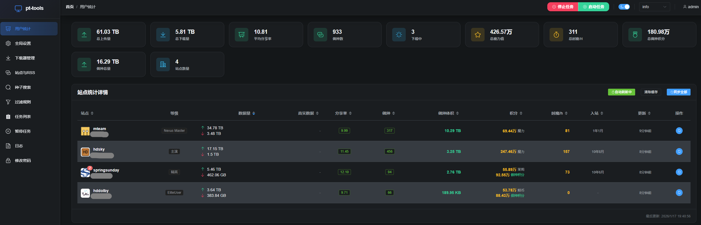
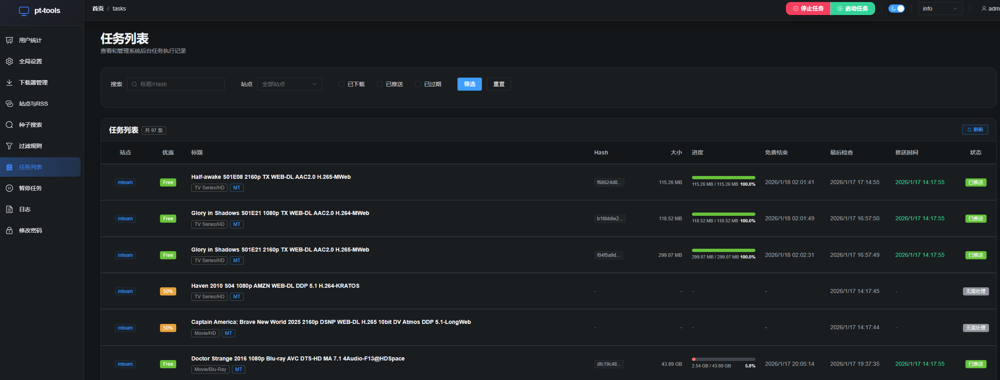

<div align="center">


# pt-tools

### 面向 PT 站点的自动化管理工具

[](https://github.com/sunerpy/pt-tools/actions/workflows/ci.yml)
[](https://github.com/sunerpy/pt-tools/releases)
[](https://hub.docker.com/r/sunerpy/pt-tools)
[](https://codecov.io/gh/sunerpy/pt-tools)
[](./LICENSE)

[功能](#功能) · [快速开始](#快速开始) · [初次配置](#初次配置) · [文档](#文档) · [开发](#开发) · [社区](#社区)

</div>

---

`pt-tools` 提供 RSS 自动下载、多站点搜索、用户数据统计、下载器管理与 ChatOps，让多个 PT 站点可以在一个 Web 界面中统一配置和维护。支持 Docker、Linux 与 Windows；当前内置适配 **66 个站点**。



<details>
<summary>查看任务列表示例</summary>



</details>

## 功能

- **RSS 自动化**：定时拉取订阅，支持关键词、通配符与正则过滤；未配置规则时默认只下载免费种子。
- **统一站点管理**：跨站点搜索、用户数据统计、等级进度与登录状态监控；内置站点见[支持站点列表](docs/sites.md)。
- **下载器管理**：支持 qBittorrent 与 Transmission，可配置多实例、下载目录、免费结束暂停和安全自动删种。
- **Web 与 ChatOps**：通过 Web UI 管理任务，也可使用 QQ OneBot 或 Telegram 私聊命令与 RSS 上新通知。
- **浏览器扩展**：PT Tools Helper 可同步 Cookie、批量刷新登录状态，并采集脱敏页面数据用于新增站点适配。
- **升级与维护**：二进制部署支持 Web 自升级；提供工作目录清理、日志轮转、备份与代理配置。

> [!WARNING]
> RSS 未关联任何过滤规则时，pt-tools **只会下载免费种子**。追剧或下载特定非免费资源时，请创建过滤规则并按需关闭「仅免费」。

## 快速开始

### Docker Compose（推荐）

```yaml
services:
  pt-tools:
    image: sunerpy/pt-tools:latest
    container_name: pt-tools
    environment:
      PT_HOST: "0.0.0.0"
      PT_PORT: "8080"
      TZ: "Asia/Shanghai"
    ports:
      - "8080:8080"
    volumes:
      - ./data:/app/.pt-tools
    restart: unless-stopped
    logging:
      driver: json-file
      options:
        max-size: "10m"
        max-file: "3"
```

保存为 `compose.yml` 后启动：

```bash
docker compose up -d
```

访问 <http://localhost:8080>，使用初始账号 `admin` / `adminadmin` 登录，并立即修改密码。

> [!IMPORTANT]
> 必须持久化 `/app/.pt-tools`。该目录包含数据库、配置和用于加密站点凭证的 `secret.key`；删除或丢失密钥后，已保存的 Cookie 无法恢复。

更多 Docker 参数、NAS 日志轮转和代理示例见[配置说明](docs/configuration.md)与[完整 Docker 示例](examples/docker-run.md)。

### 预编译二进制

从 [GitHub Releases](https://github.com/sunerpy/pt-tools/releases) 下载当前版本：

| 系统    | 架构  | 资产                             |
| ------- | ----- | -------------------------------- |
| Linux   | amd64 | `pt-tools-linux-amd64.tar.gz`    |
| Linux   | arm64 | `pt-tools-linux-arm64.tar.gz`    |
| Windows | amd64 | `pt-tools-windows-amd64.exe.zip` |
| Windows | arm64 | `pt-tools-windows-arm64.exe.zip` |

每个 Release 都提供 `checksums.txt`。安装脚本会从同一 tag 下载归档与校验和，SHA-256 不匹配时拒绝安装；固定版本的命令可直接从对应 Release 的安装说明复制。项目暂不提供 macOS 二进制，macOS 用户请使用 Docker。

二进制启动：

```bash
pt-tools web --host 0.0.0.0 --port 8080
```

Windows、systemd 与源码构建示例见[二进制运行指南](examples/binary-run.md)。

## 初次配置

1. 登录 Web UI 并修改初始密码。
2. 添加 qBittorrent 或 Transmission 下载器并测试连接。
3. 添加站点认证：Cookie 站点推荐使用 [PT Tools Helper](tools/browser-extension/README.md)；API Key / Passkey 站点按[认证信息指南](docs/guide/get-cookie-apikey.md)配置。
4. 添加 RSS 订阅并选择下载器、目录与免费结束策略。
5. 按需添加过滤规则；默认免费刷流不需要规则。
6. 备份 `~/.pt-tools/secret.key`，并确认数据库和数据目录已有外部备份。

详细流程：

- [RSS 订阅配置](docs/guide/rss-subscription.md)
- [过滤规则与追剧](docs/guide/filter-rules-tv-series.md)
- [自动删种与磁盘保护](docs/guide/auto-cleanup.md)
- [站点登录状态与密钥备份](docs/guide/site-login-monitoring.md)

## ChatOps 与浏览器扩展

QQ OneBot 与 Telegram 均支持 `/help`、`/status`、`/tasks`、`/sites`、`/torrents`、`/pause`、`/resume`、`/delete`、`/bind`、`/unbind`、`/addrss` 和 `/delrss` 等命令，并提供管理员白名单、绑定码、操作审计和 RSS 上新通知。

- [ChatOps 快速开始](docs/guide/chatops-quickstart.md)
- [QQ OneBot（NapCat）配置](docs/guide/chatops-qq-napcat.md)
- [Telegram Bot 配置](docs/guide/chatops-telegram.md)
- [RSS 上新通知](docs/guide/chatops-rss-notify.md)
- [PT Tools Helper 浏览器扩展](tools/browser-extension/README.md)

企业微信群机器人和通用 Webhook 目前仅为实验性出站通道，尚未完成端到端验证。

## 文档

从[文档中心](docs/README.md)按部署、站点、RSS、ChatOps、维护、开发和设计主题浏览全部文档。常用入口：

| 文档                                           | 用途                                 |
| ---------------------------------------------- | ------------------------------------ |
| [配置说明](docs/configuration.md)              | 环境变量、代理、下载器、持久化与日志 |
| [常见问题](docs/faq.md)                        | 认证、RSS、下载器与数据库排障        |
| [支持站点](docs/sites.md)                      | 66 个内置站点及认证方式              |
| [请求新增站点](docs/guide/request-new-site.md) | 使用扩展采集并脱敏提交站点数据       |
| [开发指南](docs/development.md)                | 工具链、构建、测试、站点适配与发版   |

每个版本的功能、修复和升级说明以 [Releases](https://github.com/sunerpy/pt-tools/releases) 与 [CHANGELOG](CHANGELOG.md) 为准。

## 开发

仓库固定使用 Go `1.26.7`、Node.js `25.2.0` 和 pnpm `10.25.0`。克隆后运行完整本地门禁：

```bash
make check
```

常用目标：

```bash
make fmt             # Go 与前端格式化
make lint            # Go、前端 lint 与类型检查
make unit-test       # Go race + coverage
make build-local     # 构建前端和当前平台二进制
make build-extension # 校验站点并打包浏览器扩展
```

贡献前请阅读[开发指南](docs/development.md)和当前目录下的 `AGENTS.md`。提交与 PR 标题遵循 Conventional Commits；新增站点请只在 `site/v2/definitions/` 添加定义并补齐 fixture 测试。

## 社区

- [GitHub Issues](https://github.com/sunerpy/pt-tools/issues)
- [GitHub Discussions](https://github.com/sunerpy/pt-tools/discussions)
- [Telegram](https://t.me/+7YK2kmWIX0s1Nzdl)
- QQ 群：`274984594`

## 许可证

[MIT License](LICENSE)

---

**免责声明**：本工具仅供学习和研究使用。请遵守各 PT 站点规则并自行评估自动化访问风险。
