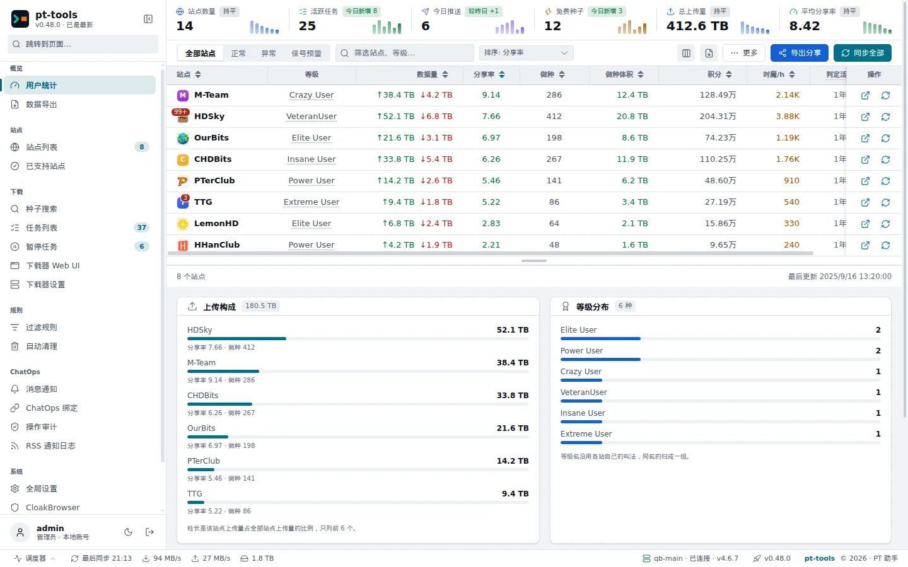
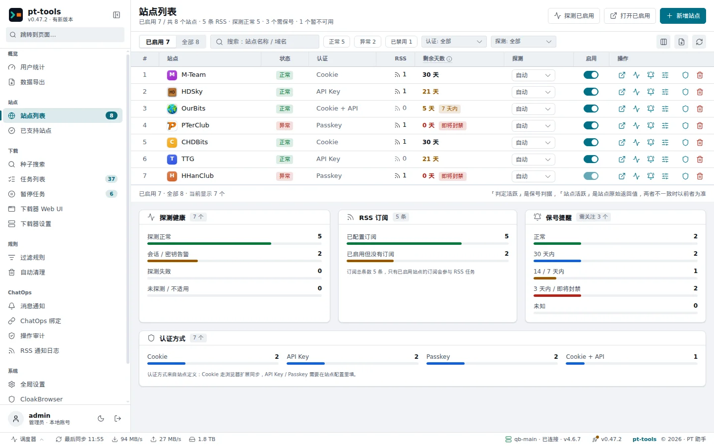
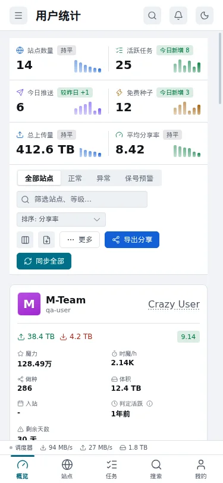

<div align="center">


# pt-tools

### 面向 PT 站点的自动化管理工具

[](https://github.com/sunerpy/pt-tools/actions/workflows/ci.yml)
[](https://github.com/sunerpy/pt-tools/releases)
[](https://hub.docker.com/r/sunerpy/pt-tools)
[](https://codecov.io/gh/sunerpy/pt-tools)
[](./LICENSE)

[文档站](https://firlab.app/pt-tools/) · [功能](#功能) · [安装](#安装) · [快速开始](#快速开始) · [用法](#用法) · [文档](#文档) · [开发](#开发)

[**简体中文**](./README.md) · [English](./docs/readme/README.en.md)

</div>

---

按 RSS 订阅自动下载免费种子，汇总各站点的数据与登录状态，统一管理 qBittorrent 和 Transmission，并可以在 QQ 和 Telegram 里查看和控制。内置 66 个站点，支持 Docker、Linux 和 Windows。完整文档在 **[firlab.app/pt-tools](https://firlab.app/pt-tools/)**。

<picture>
  <source media="(prefers-color-scheme: dark)" srcset="./docs/public/screens/home-dark.webp" />
  
</picture>

<details>
<summary>站点列表与手机界面</summary>

<picture>
  <source media="(prefers-color-scheme: dark)" srcset="./docs/public/screens/sites-dark.webp" />
  
</picture>

<picture>
  <source media="(prefers-color-scheme: dark)" srcset="./docs/public/screens/home-mobile-dark.webp" />
  
</picture>

</details>

## 功能

- **站点与数据**：66 个内置站点，覆盖 NexusPHP、mTorrent、Gazelle、HDDolby 和 Rousi 等架构，支持 Cookie、API Key 和 Passkey。在一个页面查看所有站点的上传量、分享率、做种、积分和等级进度；跨站点搜索的结果可以直接推送到下载器；长期未登录导致封号之前会提醒。
- **RSS 自动下载**：定时拉取订阅，用关键词、通配符或正则过滤标题来追剧；免费期结束时尚未下载完成的种子自动暂停。
- **刷流**：从站点的免费列表里按优惠、体积、做种与下载人数挑新种，按做种时长、分享率、上传速度删除，限定同时下载数与体积；收益按天统计并进每日战报。见[刷流任务](https://firlab.app/pt-tools/guide/brush)。
- **下载器**：可以添加多个 qBittorrent 和 Transmission，按 RSS 订阅、站点、默认下载器的顺序决定推送到哪一个。推送前检查剩余空间，按做种时长、分享率等条件清理旧种子，并保护 H&R 种子。
- **通知与 ChatOps**：在 QQ（OneBot）和 Telegram 里查看状态、暂停或删除种子、增删 RSS 订阅，每条命令都记入操作审计；RSS 上新通知支持静默时段、合并摘要、失败重试和每小时配额。企业微信与通用 Webhook 是实验性的出站通道。
- **浏览器扩展**：[PT Tools Helper](tools/browser-extension/README.md) 一键同步站点 Cookie，并采集脱敏后的页面数据，用于申请新增站点。
- **部署与维护**：Docker 镜像（amd64、arm64）与 Linux、Windows 二进制；二进制部署可以在 Web 界面升级；日志、暂存种子和旧备份先预览再清理；访问站点和下载器可以走 HTTP、HTTPS 或 SOCKS5 代理。

> [!WARNING]
> RSS 未关联任何过滤规则时，pt-tools **只会下载免费种子**。追剧或下载特定的非免费资源时，请创建过滤规则并按需关闭「仅免费」。

## 安装

### Docker Compose（推荐）

```yaml
services:
  pt-tools:
    image: sunerpy/pt-tools:latest
    container_name: pt-tools
    environment:
      PT_HOST: "0.0.0.0"
      PT_PORT: "8080"
      TZ: "Asia/Shanghai"
    ports:
      - "8080:8080"
    volumes:
      - ./data:/app/.pt-tools
    restart: unless-stopped
    logging:
      driver: json-file
      options:
        max-size: "10m"
        max-file: "3"
```

保存为 `compose.yml` 后运行 `docker compose up -d`。镜像同时发布在 Docker Hub（`sunerpy/pt-tools`）和 GHCR（`ghcr.io/sunerpy/pt-tools`），都包含 amd64 与 arm64。

> [!IMPORTANT]
> 必须持久化 `/app/.pt-tools`。这个目录里有数据库、配置和用来加密站点凭证的 `secret.key`；密钥丢失后，已保存的 Cookie 无法恢复。

### 安装脚本

```bash
# Linux
curl -fsSL https://raw.githubusercontent.com/sunerpy/pt-tools/main/scripts/install.sh | sh
```

```powershell
# Windows PowerShell
irm https://raw.githubusercontent.com/sunerpy/pt-tools/main/scripts/install.ps1 | iex
```

脚本会下载最新版本的压缩包和同一版本的 `checksums.txt`，SHA-256 不一致时拒绝安装。用 `TOOL_VERSION` 指定版本（例如 `TOOL_VERSION=v0.48.0`），Linux 上用 `TOOL_INSTALL_DIR` 指定安装目录（默认 `~/.local/bin`）。

### 预编译二进制

从 [Releases](https://github.com/sunerpy/pt-tools/releases) 下载。每个版本都附带 `checksums.txt` 和构建来源证明，`gh attestation verify` 的用法写在每个 Release 的说明里：

| 系统    | 架构  | 文件                             |
| ------- | ----- | -------------------------------- |
| Linux   | amd64 | `pt-tools-linux-amd64.tar.gz`    |
| Linux   | arm64 | `pt-tools-linux-arm64.tar.gz`    |
| Windows | amd64 | `pt-tools-windows-amd64.exe.zip` |
| Windows | arm64 | `pt-tools-windows-arm64.exe.zip` |

解压后运行 `pt-tools web --host 0.0.0.0 --port 8080`。没有 macOS 二进制，macOS 请使用 Docker。systemd 服务、Windows 与更多 Docker 示例见[安装](https://firlab.app/pt-tools/guide/install)、[二进制运行指南](examples/binary-run.md)和[Docker 示例](examples/docker-run.md)。

### 从源码构建

需要 Go `1.26.7`、Node.js `25.2.0` 和 pnpm `10.25.0`，运行 `make build-local`，详见[开发指南](docs/development.md)。

## 快速开始

1. 打开 <http://localhost:8080>，用初始账号 `admin` / `adminadmin` 登录，并立即修改密码。
2. 在「下载器设置」中添加 qBittorrent 或 Transmission，并检查连通性。
3. 添加站点认证：Cookie 站点用 [PT Tools Helper](tools/browser-extension/README.md) 同步，API Key 和 Passkey 站点按[获取 Cookie 与 API Key](https://firlab.app/pt-tools/guide/get-cookie-apikey) 填写。
4. 添加 RSS 订阅，选好下载器、保存目录和免费结束后的处理方式。默认只下免费种子，不需要过滤规则。
5. 备份 `secret.key`，并确认数据目录已有外部备份。

逐步说明见文档站的[快速开始](https://firlab.app/pt-tools/guide/quick-start)。

## 用法

- **Web 界面**：站点、RSS、过滤规则、下载器、自动清理和通知都在 Web 界面里配置。
- **ChatOps**：QQ 和 Telegram 支持 `/help`、`/status`、`/tasks`、`/sites`、`/torrents`、`/pause`、`/resume`、`/delete`、`/addrss`、`/delrss`、`/bind` 和 `/unbind`。通道的两栏名单决定谁能与机器人对话；用绑定码完成绑定的账号都能执行管理命令，所以绑定码只发给信任的人。见 [ChatOps 快速开始](https://firlab.app/pt-tools/guide/chatops-quickstart)。
- **命令行**：`pt-tools web` 启动服务，`pt-tools secret` 导出、导入加密密钥，`pt-tools clean` 预览并清理已轮转的日志、暂存种子和旧备份，见[命令行](https://firlab.app/pt-tools/reference/cli)。

## 文档

文档站 **[firlab.app/pt-tools](https://firlab.app/pt-tools/)**（中文，[English](https://firlab.app/pt-tools/en/)）的内容来自本仓库的 `docs/` 目录，在 GitHub 上也可以从[文档中心](docs/README.md)按主题浏览。

| 文档                                                                       | 内容                                 |
| -------------------------------------------------------------------------- | ------------------------------------ |
| [安装](https://firlab.app/pt-tools/guide/install)                          | Docker、二进制、systemd 与首次登录   |
| [配置说明](https://firlab.app/pt-tools/configuration)                      | 环境变量、代理、下载器、持久化与日志 |
| [RSS 订阅](https://firlab.app/pt-tools/guide/rss-subscription)             | 订阅、下载器选择、免费结束策略       |
| [过滤规则与追剧](https://firlab.app/pt-tools/guide/filter-rules-tv-series) | 关键词、通配符与正则规则             |
| [自动删种与磁盘保护](https://firlab.app/pt-tools/guide/auto-cleanup)       | 清理条件、H&R 保护与剩余空间检查     |
| [站点登录监控](https://firlab.app/pt-tools/guide/site-login-monitoring)    | 登录探测、保号提醒与密钥备份         |
| [ChatOps](https://firlab.app/pt-tools/guide/chatops-quickstart)            | QQ、Telegram、绑定与 RSS 上新通知    |
| [升级与备份](https://firlab.app/pt-tools/guide/upgrade)                    | 各安装方式的升级、备份与恢复         |
| [数据与安全](https://firlab.app/pt-tools/reference/security)               | 数据位置、加密范围、外连与部署建议   |
| [支持站点](https://firlab.app/pt-tools/sites)                              | 66 个内置站点及认证方式              |
| [请求新增站点](https://firlab.app/pt-tools/guide/request-new-site)         | 用扩展采集并脱敏提交站点数据         |
| [常见问题](https://firlab.app/pt-tools/faq)                                | 认证、RSS、下载器与数据库排障        |

每个版本的功能、修复和升级说明见 [Releases](https://github.com/sunerpy/pt-tools/releases) 与 [CHANGELOG](CHANGELOG.md)。

## 开发

仓库固定使用 Go `1.26.7`、Node.js `25.2.0` 和 pnpm `10.25.0`。克隆后运行完整的本地门禁：

```bash
make check
```

常用目标：

```bash
make fmt             # Go 与前端格式化
make lint            # Go、前端 lint 与类型检查
make test            # 前端构建与单测，Go race 测试
make docs-check      # 仓库内 Markdown 的相对链接与锚点
make build-local     # 构建前端和当前平台的二进制
make build-extension # 校验站点并打包浏览器扩展
```

贡献前请阅读[开发指南](docs/development.md)和仓库根目录的 `AGENTS.md`。提交与 PR 标题遵循 Conventional Commits；新增站点只在 `site/v2/definitions/` 添加定义，并补齐 fixture 测试。文档站的写作约定与上线流程见 [docs/README.md](docs/README.md)。

## 社区

- [GitHub Issues](https://github.com/sunerpy/pt-tools/issues)
- [GitHub Discussions](https://github.com/sunerpy/pt-tools/discussions)
- [Telegram](https://t.me/+7YK2kmWIX0s1Nzdl)
- QQ 群：`274984594`
- 微信公众号：六月水蓝，微信扫描下方二维码关注


## 许可证

[MIT License](LICENSE)

---

**免责声明**：本工具仅供学习和研究使用。请遵守各 PT 站点的规则，并自行评估自动化访问的风险。
