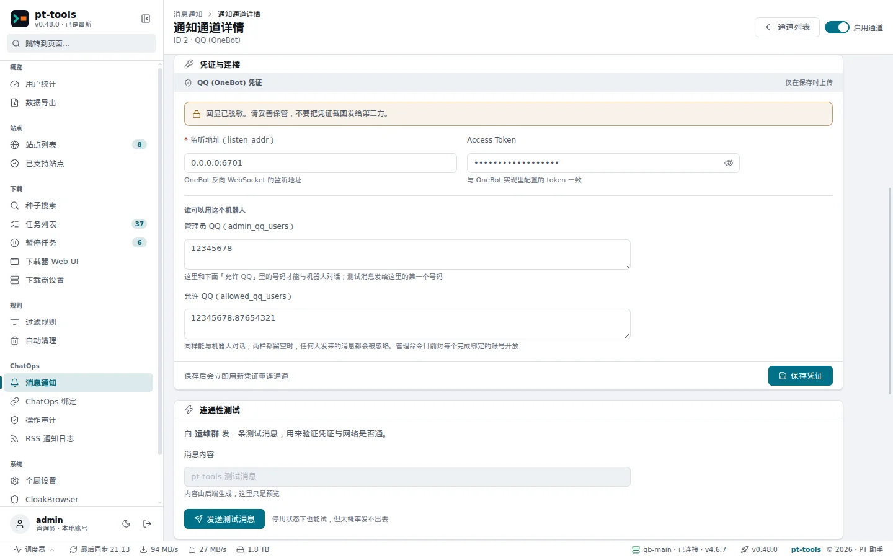
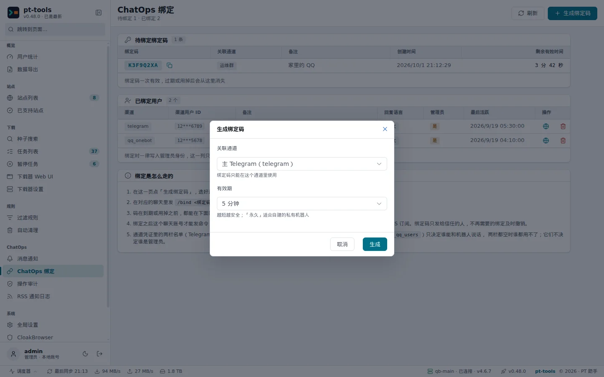

# QQ through OneBot (NapCat)

This page explains how to connect a QQ account to pt-tools through **NapCatQQ**, so that you can control pt-tools with commands in a private chat and receive system notifications.

---

## 1. Before you start

- A **secondary QQ account** to act as the bot (using your main account is strongly discouraged, because of the risk of it being restricted)
- A machine with **Docker** installed (the one running pt-tools or another one, as long as the two can reach each other over the network)
- pt-tools already running, with its web UI reachable

> [!WARNING]
> QQ protocol bridges (NapCat, LLOneBot and the like) are third-party community projects, and the account they use may be restricted or banned by QQ's risk controls. Use a dedicated secondary account, never your everyday one.

---

## 2. Deploying NapCat (Docker)

### Quick start

Run this command in a terminal to start the NapCat container:

```bash
docker run -d \
  --name napcat \
  --restart always \
  -e NAPCAT_UID=$(id -u) \
  -e NAPCAT_GID=$(id -g) \
  -p 3001:3001 \
  -p 6099:6099 \
  -v $(pwd)/napcat/config:/app/napcat/config \
  -v $(pwd)/ntqq:/app/.config/QQ \
  mlikiowa/napcat-docker:v4.18.1
```

The options:

| Option                             | Meaning                                                                                 |
| ---------------------------------- | --------------------------------------------------------------------------------------- |
| `NAPCAT_UID` / `NAPCAT_GID`        | Runs as the current user, which avoids permission problems on the mounted folders       |
| `-p 3001:3001`                     | The QQ protocol port (used inside NapCat)                                               |
| `-p 6099:6099`                     | The NapCat WebUI port, which you open in a browser to manage it                         |
| `napcat/config:/app/napcat/config` | Keeps NapCat's own settings (network settings, tokens and so on)                        |
| `ntqq:/app/.config/QQ`             | Keeps the QQ sign-in data (device information, session), so a restart needs no new scan |

### With Docker Compose

If you prefer Compose, save the following as `docker-compose.yml` and run `docker compose up -d`:

```yaml
services:
  napcat:
    image: mlikiowa/napcat-docker:v4.18.1
    container_name: napcat
    restart: always
    environment:
      NAPCAT_UID: "${UID:-1000}"
      NAPCAT_GID: "${GID:-1000}"
    ports:
      - "3001:3001"
      - "6099:6099"
    volumes:
      - ./napcat/config:/app/napcat/config
      - ./ntqq:/app/.config/QQ
```

---

## 3. Signing in to the NapCat WebUI for the first time

Once the container is running, open `http://<NapCat-host-IP>:6099/webui` in a browser.

The **token for the first sign-in** is in the container's log:

```bash
docker logs napcat | grep token
```

Look for a line like this:

```
[NapCat] webui token: abc123def456
```

Enter the token in the sign-in box and sign in.

---

## 4. Signing in to QQ by scanning a QR code

After signing in to the WebUI, open its sign-in page, which shows a QR code.

Scan it with mobile QQ, signed in as the secondary account that will be the bot, and approve the sign-in.

Once signed in, the WebUI home page shows the account's QQ number and its online status.

---

## 5. Setting up the reverse WebSocket

pt-tools uses **reverse WebSocket** mode: NapCat connects to an address pt-tools listens on, rather than pt-tools connecting to NapCat.

In the NapCat WebUI:

1. Open the network settings
2. Find the WebSocket client section
3. Click Add

Fill in the following:

| Field              | Value                                         | Notes                                                 |
| ------------------ | --------------------------------------------- | ----------------------------------------------------- |
| URL                | `ws://<pt-tools-host-IP>:6701/onebot/v11/ws`  | The port and path must match pt-tools' settings       |
| Token              | `ptqa_2026_secret` (your own, 16+ characters) | Both sides must use the same value                    |
| Message format     | `array`                                       | Always choose array; pt-tools only parses this format |
| Heartbeat interval | `30000` (milliseconds)                        | 30 s is recommended                                   |
| Reconnect interval | `5000` (milliseconds)                         | 5 s is recommended                                    |

Turn the entry on, then save.

---

## 6. Setting up pt-tools

Open the pt-tools web UI, go to ChatOps → Notifications (消息通知) and click **Add channel (添加通道)**:

1. Choose **QQ (OneBot)** as the channel type, enter a channel name (anything, such as `Main QQ`, so you can recognise it) and click **Create channel (创建通道)**.
2. In the channel list, click the new channel to open its details.
3. Under **Credentials and connection (凭证与连接)**, fill in the fields below and click **Save credentials (保存凭证)**. The channel reconnects with the new settings as soon as they are saved.

| Field                                  | Value                               | Notes                                                                                                            |
| -------------------------------------- | ----------------------------------- | ---------------------------------------------------------------------------------------------------------------- |
| Listen address (监听地址, listen_addr) | `0.0.0.0:6701`                      | The address the reverse WebSocket listens on; the port must match NapCat's                                       |
| Access Token                           | `ptqa_2026_secret`                  | Exactly the same token as in NapCat                                                                              |
| Admin QQ (管理员 QQ, admin_qq_users)   | `your QQ number`                    | QQ numbers separated by commas; they may talk to the bot, and the test message goes to the first one (see below) |
| Allowed QQ (允许 QQ, allowed_qq_users) | Empty, or other people's QQ numbers | QQ numbers separated by commas; they may talk to the bot as well (see below)                                     |

The WebSocket path is always `/onebot/v11/ws`; make sure the path in NapCat's URL is the same.

> [!IMPORTANT]
> Admin QQ and Allowed QQ are allow lists for talking to the bot: only messages from a QQ number in one of the two lists are handled; messages from anyone else are ignored without a reply (the log records 拒绝非授权用户, "rejected unauthorised user"). **When both lists are empty, nobody can use the bot**, not even to link an account. The lists do not grant admin rights: a number that may talk to the bot still has to be linked with a binding code before it can run commands, and **every linked account has admin rights**, so it can pause, resume and delete torrents and manage RSS subscriptions. Give binding codes only to accounts you trust, and revoke a binding under ChatOps → ChatOps binding (ChatOps 绑定) when it is no longer needed.

After saving, the channel's status first shows Running (运行中: the port is listening), then Connected (已连接) once NapCat has connected.


> Web UI → ChatOps → Notifications: once added, the QQ channel shows as enabled.



> Credentials and connection, on the QQ channel's details page, is where you see and change the listen address, the access token and the admin list.

---

## 7. Checking the connection

Once its settings are saved, NapCat tries to connect to pt-tools on its own. When it succeeds, the channel's status changes to Connected, and pt-tools' log (System → Logs, 系统 → 运行日志) shows a line like this:

```
QQ 适配器(1): [wss] 连接Websocket服务器: 172.18.0.3:41526 成功, 账号: 123456789
```

The address is NapCat's end of the connection, and the account is the bot's QQ number.

You can also send a **test message** from the channel list or the channel's details page. If it arrives in mobile QQ, outbound notifications work.

---

## 8. Linking your account and trying a command

A connection is only the first step. You also need to link your QQ number to pt-tools before the bot recognises you and responds to your commands.

### Generating a binding code

In the web UI, open ChatOps → ChatOps binding (ChatOps 绑定) and click **Generate binding code (生成绑定码)**:

- Choose the QQ channel you set up above
- Leave the validity at 5 minutes (the default)
- Click Generate



> When generating a binding code, you choose the channel it is for and how long it is valid (5 minutes, 1 hour, 1 day, 30 days or no expiry).

The code appears in the Pending (待绑定) list: an 8-character string such as `A3F7KP2M`.

### Linking in QQ

From your **personal QQ account** (not the bot's), send the bot a **private message**. The number must already be in Admin QQ or Allowed QQ from section 6; otherwise the message is ignored:

```
/bind A3F7KP2M
```

When the bot replies 绑定成功 ("linked"), you are done.

### Trying `/help`

Once linked, send `/help`; the bot lists all 13 commands.

A linked account has admin rights, so it can use admin commands such as `/pause`, `/resume` and `/delete`.

---

## 9. Questions

### Q: pt-tools' log shows "ECONNREFUSED"

**Cause**: pt-tools is not listening on port 6701, or a firewall blocks the port.

**Check:**

```bash
# Make sure pt-tools is listening
ss -tlnp | grep 6701
# or
netstat -tlnp | grep 6701
```

If nothing is listening, check that the channel's listen address (`listen_addr`) is right and that the channel is enabled.

If the port is listening but NapCat cannot connect, check the firewall rules:

```bash
# Temporary test (CentOS/RHEL)
firewall-cmd --add-port=6701/tcp --zone=public
# Ubuntu/Debian
ufw allow 6701/tcp
```

---

### Q: NapCat says it is connected, but the bot does not respond to commands

**Cause 1**: your QQ number is in neither Admin QQ nor Allowed QQ, so its messages are ignored (the log shows 拒绝非授权用户, "rejected unauthorised user"). Add the number to one of the lists and save the credentials.

**Cause 2**: your QQ number is not linked yet; the bot replies 请先 /bind <绑定码> 完成绑定. Follow the linking steps in section 8 first.

**Cause 3**: the WebSocket may be half dead (the connection exists, but messages do not get through). pt-tools sends a ping every 30 seconds and, when nothing at all arrives for 90 seconds, closes the connection so that NapCat reconnects. ChatOps has been released since v0.31.0, and every release includes this. If you are running an earlier test build, upgrade to the latest version.

---

### Q: The bot does not react at all, not even with DENIED

**Cause**: test builds from before the ChatOps release (v0.31.0) could deadlock in the read loop; the releases are fixed. Upgrade to the latest version.

---

### Q: The log shows errors such as "bot removed from the group"

**Cause**: test builds from before the ChatOps release (v0.31.0) mistook private messages for group messages and then concluded that the bot had been removed from the group. The releases are fixed; upgrade to the latest version.

---

### Q: What is the difference between `admin_qq_users` and `allowed_qq_users`?

For incoming messages there is no difference: a QQ number in either list may talk to the bot, messages from numbers in neither list are ignored, and with both lists empty nobody can use the bot. Neither list grants admin rights. The only difference is the test message: it goes to the first Admin QQ number; if there is none, to the first Allowed QQ number; if both are empty, to the first linked account.

- When a listed QQ number that is not linked sends a command, the bot replies 请先 /bind <绑定码> 完成绑定 ("link first with /bind followed by the code") and runs nothing.
- A linked QQ number can run every command, including the admin commands.

So controlling who can operate pt-tools takes both: put only the numbers that need it in the lists, give binding codes only to accounts you trust, and revoke bindings that are no longer needed.

---

## 10. Advanced setup

### Running pt-tools and NapCat with one docker-compose.yml

```yaml
services:
  pt-tools:
    image: sunerpy/pt-tools:latest
    container_name: pt-tools
    environment:
      PT_HOST: "0.0.0.0"
      PT_PORT: "8080"
      TZ: "Asia/Shanghai"
    ports:
      - "8080:8080"
      - "6701:6701" # QQ OneBot reverse WebSocket port
    volumes:
      - ./data:/app/.pt-tools
    restart: unless-stopped

  napcat:
    image: mlikiowa/napcat-docker:v4.18.1
    container_name: napcat
    restart: always
    environment:
      NAPCAT_UID: "${UID:-1000}"
      NAPCAT_GID: "${GID:-1000}"
    ports:
      - "6099:6099"
    volumes:
      - ./napcat/config:/app/napcat/config
      - ./ntqq:/app/.config/QQ
    depends_on:
      - pt-tools
```

In this setup, NapCat's WebSocket URL is `ws://pt-tools:6701/onebot/v11/ws` (using Docker's internal DNS).

---

### Running NapCat under systemd (without Docker)

Without Docker, you can run NapCat as a systemd service:

```ini
[Unit]
Description=NapCatQQ
After=network.target

[Service]
Type=simple
User=your-user
WorkingDirectory=/opt/napcat
ExecStart=/opt/napcat/napcat.sh
Restart=on-failure
RestartSec=10

[Install]
WantedBy=multi-user.target
```

---

### Proxying the WebSocket with Caddy

If pt-tools is on your local network and NapCat has to connect from the internet, Caddy can act as an HTTPS/WSS reverse proxy:

```caddyfile
ws.your-domain.com {
    reverse_proxy /onebot/v11/ws localhost:6701
}
```

Change NapCat's URL to `wss://ws.your-domain.com/onebot/v11/ws`, and use an access token as well.

---

### Tuning the heartbeat

On a poor network, a shorter heartbeat detects a dropped connection sooner:

- NapCat `heartInterval`: 15000 (15 seconds)
- NapCat `reconnectInterval`: 3000 (3 seconds)

pt-tools sends a ping every 30 seconds; if nothing at all arrives for 90 seconds (including NapCat's heartbeats and pongs), it closes the connection so that NapCat reconnects.
