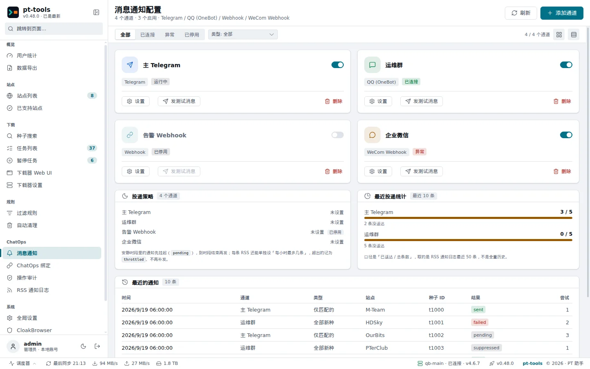
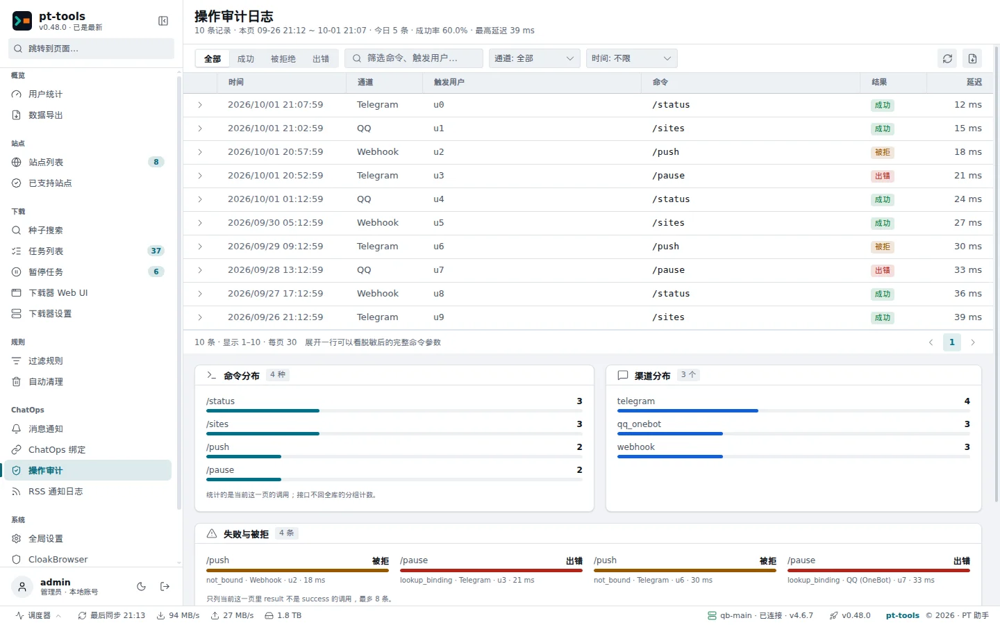

# ChatOps quick start

pt-tools has a built-in ChatOps layer: from a **QQ private chat** or a **Telegram private chat** you can check download status, control tasks and receive event notifications at any time, without opening a browser.

---

## Overview

The idea is the same as in Hermes or MoviePilot: you send a command to a bot in a chat app you already use, the bot calls pt-tools' services and replies with the result. The whole exchange happens in a private chat, so the web UI port never needs to be exposed.

Highlights:

- **Built-in commands** covering status queries, torrent control, task management and site sign-in
- **Linked accounts only**: only an account linked with a binding code can run commands; QQ and Telegram channels also check the sender against the channel's allow lists first
- **Binding codes**: an 8-character one-time code, valid for 5 minutes by default (from 1 hour up to no expiry if you choose), generated in the web UI and sent to the person whose account you want to link
- **An audit trail**: the result, latency and sender of every command are recorded in the `action_audit` table
- **Encryption at rest**: credentials such as the bot token and the access token are stored encrypted with AES-GCM, so a screenshot never shows them in plain text
- **Outbound notifications**: besides replying to commands, pt-tools can push system events (a torrent pushed, a disk space warning and so on) to the chat app

---

## Supported channels

| Channel                          | Protocol                     | Inbound commands | Outbound notifications | Recommended for                                                                                  |
| -------------------------------- | ---------------------------- | :--------------: | :--------------------: | ------------------------------------------------------------------------------------------------ |
| **QQ OneBot**                    | OneBot v11 reverse WebSocket |        ✅        |           ✅           | People whose everyday chat app is QQ                                                             |
| **Telegram**                     | Bot API long polling         |        ✅        |           ✅           | People outside mainland China, or who need notifications over the open internet                  |
| **WeCom group bot**              | WeCom webhook                |        ❌        |           ✅           | Outbound notifications (alerts in a group); see [More notification channels](notify-channels.md) |
| **DingTalk / Feishu group bots** | Webhook (optional signing)   |        ❌        |           ✅           | Outbound notifications; see [More notification channels](notify-channels.md)                     |
| **Bark / ServerChan / ntfy**     | Their push APIs              |        ❌        |           ✅           | Notifications on your phone; see [More notification channels](notify-channels.md)                |
| **Generic webhook** ⚠️           | HMAC-SHA256 HTTP             |        ❌        |    🧪 Experimental     | Custom integrations such as n8n or Zapier; implemented but **not yet verified end to end**       |

> Inbound commands (chat app → pt-tools) need a two-way connection; the webhook channels only push outbound.

---

## Which channel?

```
Do you want to send commands to pt-tools from a chat app?
│
├── Yes → Is QQ your main chat app?
│        ├── Yes → QQ OneBot (NapCat)  →  docs/en/guide/chatops-qq-napcat.md
│        └── No → Can you reach Telegram?
│                  ├── Yes → Telegram bot  →  docs/en/guide/chatops-telegram.md
│                  └── No → Use Telegram through a proxy
│
└── Only outbound notifications (events pushed to a group)?
     ├── A WeCom, DingTalk or Feishu group → the matching group bot (docs/en/guide/notify-channels.md)
     ├── Your phone → Bark, ServerChan or ntfy (docs/en/guide/notify-channels.md)
     └── Your own system → set up the generic webhook
```

---

## Built-in commands

Every command starts with `/` and is sent in the private chat. Commands are case-insensitive.

| Command          | What it does                                                                                                     | Permission |
| ---------------- | ---------------------------------------------------------------------------------------------------------------- | ---------- |
| `/help`          | Lists every available command and how to use it                                                                  | User       |
| `/status`        | System status: speeds, disk space and the number of active tasks                                                 | User       |
| `/version`       | The current version and the latest available one                                                                 | User       |
| `/tasks`         | The RSS tasks and whether they are running                                                                       | User       |
| `/sites`         | A summary of the configured sites (name, type)                                                                   | User       |
| `/torrents`      | Lists the torrents of each downloader, a page at a time                                                          | User       |
| `/pause <hash>`  | Pauses a torrent (a prefix of the hash is enough)                                                                | Admin      |
| `/resume <hash>` | Resumes a torrent                                                                                                | Admin      |
| `/delete <hash>` | Deletes a torrent, after a confirmation                                                                          | Admin      |
| `/signin [site]` | Signs in now; without a site, signs in every site with automatic sign-in enabled that has no result today        | Admin      |
| `/bind <code>`   | Links the current account to pt-tools with an 8-character binding code                                           | Anyone     |
| `/unbind`        | Unlinks the current account                                                                                      | Admin      |
| `/addrss`        | Adds an RSS subscription interactively (a text wizard, or one line: `/addrss site \| name \| URL \| downloader`) | Admin      |
| `/delrss`        | Deletes an RSS subscription interactively (lists them first, then you choose one by name, ID or number)          | Admin      |

> **Rate limit**: by default each user can send at most 10 commands a minute. Further commands are silently dropped, with no error reply, so nothing is revealed to the sender.

> [!IMPORTANT]
> At present **every linked account has admin rights**: the commands marked Admin in the table are available to every linked account. Give binding codes only to accounts you trust, and revoke a binding under ChatOps → ChatOps binding (ChatOps 绑定) when it is no longer needed.

---

## Setting it up

Continue with the guide for the channel you chose:

- **QQ (NapCat)** → [QQ through OneBot (NapCat)](chatops-qq-napcat.md)
- **Telegram** → [Telegram bot](chatops-telegram.md)

Once it is set up, open the audit log page of the web UI (`/chatops/audit`) to confirm that commands run and are recorded.



> Web UI → ChatOps → Notifications (消息通知) shows the QQ and Telegram channels you have configured.



> Web UI → ChatOps → Audit log (操作审计) shows today's command count, the success rate and the latest records.

---

## Notifications for new RSS items

Once a channel is set up, pt-tools can also tell you when an RSS feed brings in a new torrent:

- **all mode**: every new item (only the feed's own fields are used, with no extra request to the site)
- **filtered mode**: only when a filter rule matches (good for following a series or picking Blu-ray releases)
- **both mode**: both at once; when a filtered match arrives, it supersedes the all-mode notification for the same torrent

Quiet hours (HH:MM, which may span midnight), a 30-second digest that combines notifications, retries with exponential backoff and inline Telegram buttons (download now / ignore) are all supported.

Details → **[New-torrent notifications](chatops-rss-notify.md)**
