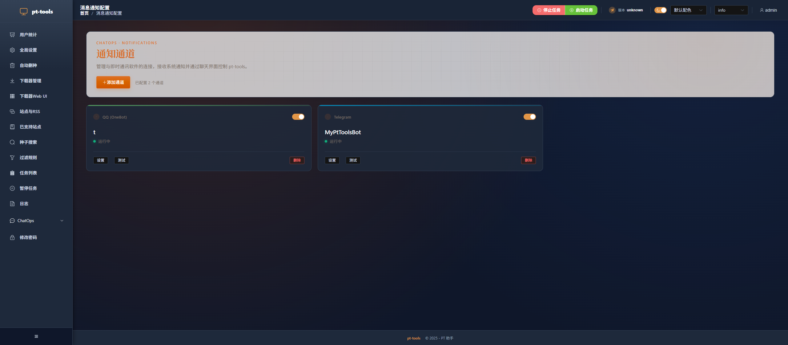
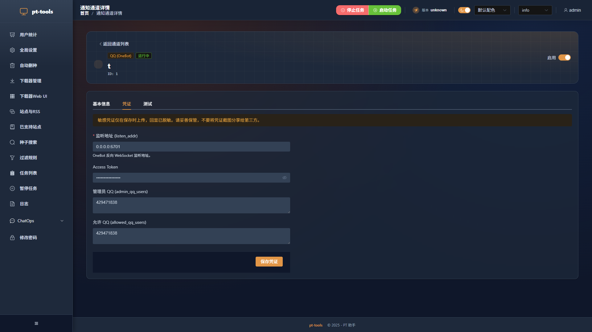

# QQ OneBot (NapCat) 配置指南

[← 返回 ChatOps 快速开始](chatops-quickstart.md) | [返回首页](../../README.md)

本文介绍如何通过 **NapCatQQ** 将你的 QQ 账号接入 pt-tools，实现私聊命令控制和系统通知推送。

---

## 目录

1. [前置条件](#1-前置条件)
2. [NapCat 部署（Docker）](#2-napcat-部署docker)
3. [NapCat WebUI 首次登录](#3-napcat-webui-首次登录)
4. [QQ 账号扫码登录](#4-qq-账号扫码登录)
5. [配置反向 WebSocket](#5-配置反向-websocket)
6. [pt-tools 端配置](#6-pt-tools-端配置)
7. [验证连接](#7-验证连接)
8. [绑定账号与测试命令](#8-绑定账号与测试命令)
9. [常见问题 FAQ](#9-常见问题-faq)
10. [进阶配置](#10-进阶配置)

---

## 1. 前置条件

- 一个用于做 bot 的 **QQ 小号**（强烈不建议用主力号，存在被风控的风险）
- 安装了 **Docker** 的机器（可以是运行 pt-tools 的同一台，也可以是别的机器，但两台需要网络互通）
- pt-tools 服务已经在运行，Web UI 可以正常访问

> [!WARNING]
> QQ 协议桥（NapCat / LLOneBot 等）属于第三方社区方案，存在账号被 QQ 风控封禁的风险。请使用专用小号，不要用日常主力 QQ。

---

## 2. NapCat 部署（Docker）

### 快速启动

在终端执行下面的命令，把 NapCat 容器跑起来：

```bash
docker run -d \
  --name napcat \
  --restart always \
  -e NAPCAT_UID=$(id -u) \
  -e NAPCAT_GID=$(id -g) \
  -p 3001:3001 \
  -p 6099:6099 \
  -v $(pwd)/napcat/config:/app/napcat/config \
  -v $(pwd)/ntqq:/app/.config/QQ \
  mlikiowa/napcat-docker:v4.18.1
```

参数说明：

| 参数                               | 说明                                                          |
| ---------------------------------- | ------------------------------------------------------------- |
| `NAPCAT_UID` / `NAPCAT_GID`        | 以当前用户身份运行，避免挂载目录权限问题                      |
| `-p 3001:3001`                     | QQ 协议端口（NapCat 内部通信用）                              |
| `-p 6099:6099`                     | NapCat WebUI 端口，浏览器通过此端口管理                       |
| `napcat/config:/app/napcat/config` | 持久化 NapCat 自身配置（网络配置、token 等）                  |
| `ntqq:/app/.config/QQ`             | 持久化 QQ 登录数据（设备信息、session），重启后不需要重新扫码 |

### Docker Compose 方式

如果你更习惯 Compose 管理，把下面的内容保存为 `docker-compose.yml` 后执行 `docker compose up -d`：

```yaml
services:
  napcat:
    image: mlikiowa/napcat-docker:v4.18.1
    container_name: napcat
    restart: always
    environment:
      NAPCAT_UID: "${UID:-1000}"
      NAPCAT_GID: "${GID:-1000}"
    ports:
      - "3001:3001"
      - "6099:6099"
    volumes:
      - ./napcat/config:/app/napcat/config
      - ./ntqq:/app/.config/QQ
```

---

## 3. NapCat WebUI 首次登录

容器启动后，在浏览器访问 `http://<NapCat所在机器IP>:6099/webui`。

**首次登录 token** 在容器日志里，用下面的命令查看：

```bash
docker logs napcat | grep token
```

找到类似这样的一行：

```
[NapCat] webui token: abc123def456
```

把 token 填入登录框，点击登录。

---

## 4. QQ 账号扫码登录

登录 WebUI 后，进入「登录」页面，系统会生成一个二维码。

用作 bot 的 QQ 小号，在手机 QQ 上扫码，完成登录授权。

登录成功后，WebUI 首页会显示当前登录账号的 QQ 号和在线状态。

---

## 5. 配置反向 WebSocket

pt-tools 使用**反向 WebSocket（Reverse WS）**模式：NapCat 主动连接到 pt-tools 监听的地址，而不是 pt-tools 去连 NapCat。

在 NapCat WebUI 里：

1. 进入「网络配置」
2. 找到「WebSocket 客户端」部分
3. 点击「添加」

填写以下内容：

| 字段     | 填写值                                     | 说明                                 |
| -------- | ------------------------------------------ | ------------------------------------ |
| URL      | `ws://<pt-tools主机IP>:6701/onebot/v11/ws` | 端口和路径要与 pt-tools 配置保持一致 |
| Token    | `ptqa_2026_secret`（自定义 16+ 字符）      | 双方必须填同一个值                   |
| 消息格式 | `array`                                    | 固定选 array，pt-tools 只解析此格式  |
| 心跳间隔 | `30000`（毫秒）                            | 推荐 30s                             |
| 重连间隔 | `5000`（毫秒）                             | 推荐 5s                              |

填好后点「启用」，再保存。

---

## 6. pt-tools 端配置

打开 pt-tools Web UI，进入「ChatOps → 通知通道」，点「**添加通道**」。

选择通道类型：**QQ (OneBot)**

填写表单：

| 字段                             | 填写值                     | 说明                                  |
| -------------------------------- | -------------------------- | ------------------------------------- |
| 通道名称                         | 任意，如 `主 QQ`           | 方便自己辨认                          |
| 监听地址（listen_addr）          | `0.0.0.0:6701`             | 与 NapCat 里配置的端口一致            |
| WebSocket 路径（path）           | `/onebot/v11/ws`           | 与 NapCat URL 中的路径一致            |
| Access Token                     | `ptqa_2026_secret`         | 与 NapCat 里填的 token 完全一致       |
| 管理员 QQ 列表（admin_qq_users） | `[你的QQ号]`               | 支持管理员命令（pause/resume/delete） |
| 白名单（allowed_qq_users）       | `[]`（或填其他允许的号码） | 不在列表里的消息会被静默丢弃          |

点「确定」保存。通道状态应显示「运行中」。



> Web UI → ChatOps → 通知通道，添加完成后可以看到 QQ 通道已启用



> 进入 QQ 通道的「凭证」标签，可以查看和修改监听地址、Access Token、管理员列表

---

## 7. 验证连接

NapCat 配置保存后，会自动尝试连接到 pt-tools。连接成功后，pt-tools 的日志（Web UI → 日志）应出现：

```
INFO  qq_onebot adapter: websocket client connected, conf_id=1
```

或者类似：

```
[wss] 连接 Websocket 服务器: ws://0.0.0.0:6701/onebot/v11/ws 成功, 账号: 123456789
```

也可以在通道列表点「**测试**」，pt-tools 会向 bot 的 QQ 号发送一条测试消息。如果你的手机 QQ 收到了消息，说明出站推送正常。

---

## 8. 绑定账号与测试命令

连接建立只是第一步。还需要把你的 QQ 号和 pt-tools 做绑定，bot 才认识你、才响应你的命令。

### 生成绑定码

在 Web UI 打开「ChatOps → 绑定管理」，点「**生成绑定码**」：

- 选择刚配置的 QQ 通道
- 有效期选「5 分钟」（默认）
- 点「生成」


> 生成绑定码时需要选择关联的通道和有效期（5分钟/1小时/1天/30天/永久）

绑定码会出现在「待绑定 Code」列表里，是一个 8 字符的字符串，类似 `A3F7KP2M`。

### 在 QQ 里完成绑定

用你的**个人 QQ**（不是 bot 那个号），**私聊**发给 bot：

```
/bind A3F7KP2M
```

bot 应该回复：

```
✅ 绑定成功！你已绑定到 pt-tools。发送 /help 查看可用命令。
```

### 测试 `/help`

绑定成功后，发送 `/help`，bot 会列出所有 11 个可用命令。

如果你设置了 `admin_qq_users`，你的账号会自动获得管理员权限，可以使用 `/pause`、`/resume`、`/delete`。

---

## 9. 常见问题 FAQ

### Q: pt-tools 日志显示「ECONNREFUSED」

**原因**：pt-tools 没有正确监听 6701 端口，或者防火墙把端口挡住了。

**检查**：

```bash
# 确认 pt-tools 在监听
ss -tlnp | grep 6701
# 或
netstat -tlnp | grep 6701
```

如果端口没有监听，检查通道配置里的 `listen_addr` 是否填正确，且通道处于「启用」状态。

如果端口在监听但 NapCat 连不上，检查防火墙规则：

```bash
# 临时测试（CentOS/RHEL）
firewall-cmd --add-port=6701/tcp --zone=public
# Ubuntu/Debian
ufw allow 6701/tcp
```

---

### Q: NapCat 显示连上了但 bot 不响应命令

**原因一**：你的 QQ 号还没有完成绑定，bot 不认识你。先执行第 8 节的绑定流程。

**原因二**：可能碰到了 WebSocket 半死的问题（连接存在但消息不通）。pt-tools commit `4adfae0` 加了 ping/pong 自愈机制，确保你使用的版本包含这个 commit。

---

### Q: 发了命令 bot 没有任何反应，连 DENIED 也没有

**原因**：可能是 read 循环死锁。commit `20bb38a` 修复了这个问题。升级到包含该 commit 的版本。

---

### Q: 日志出现「bot 被移出群」之类的错误

**原因**：旧版本存在一个 bug，把私聊消息误识别为群消息处理，然后判断「机器人被移出了这个群」。commit `ed1286c` 修复了此问题。确保版本 ≥ `ed1286c`。

---

### Q: `admin_qq_users` 和 `allowed_qq_users` 有什么区别？

`admin_qq_users` 里的号可以使用管理员命令（`/pause`、`/resume`、`/delete`）。

`allowed_qq_users` 是白名单，不在列表里的号发的消息直接被丢弃，连 DENIED 回复都没有（防止信息泄露）。如果你只想让自己用，可以把自己同时加入两个列表；如果想让其他人也能查询只读状态，只加入 `allowed_qq_users` 即可。

---

## 10. 进阶配置

### 使用 docker-compose.yml 配合 pt-tools 一起编排

```yaml
services:
  pt-tools:
    image: sunerpy/pt-tools:latest
    container_name: pt-tools
    environment:
      PT_HOST: "0.0.0.0"
      PT_PORT: "8080"
      TZ: "Asia/Shanghai"
    ports:
      - "8080:8080"
      - "6701:6701" # QQ OneBot 反向 WS 端口
    volumes:
      - ./data:/app/.pt-tools
    restart: unless-stopped

  napcat:
    image: mlikiowa/napcat-docker:v4.18.1
    container_name: napcat
    restart: always
    environment:
      NAPCAT_UID: "${UID:-1000}"
      NAPCAT_GID: "${GID:-1000}"
    ports:
      - "6099:6099"
    volumes:
      - ./napcat/config:/app/napcat/config
      - ./ntqq:/app/.config/QQ
    depends_on:
      - pt-tools
```

在这个场景里，NapCat 的 WebSocket URL 填 `ws://pt-tools:6701/onebot/v11/ws`（用 Docker 内网 DNS）。

---

### systemd 守护 NapCat（非 Docker）

如果你不用 Docker，可以把 NapCat 配成 systemd 服务：

```ini
[Unit]
Description=NapCatQQ
After=network.target

[Service]
Type=simple
User=your-user
WorkingDirectory=/opt/napcat
ExecStart=/opt/napcat/napcat.sh
Restart=on-failure
RestartSec=10

[Install]
WantedBy=multi-user.target
```

---

### Caddy 反代 WebSocket

如果 pt-tools 在内网且你需要通过外网的 NapCat 连接，可以用 Caddy 做 HTTPS/WSS 反代：

```caddyfile
ws.your-domain.com {
    reverse_proxy /onebot/v11/ws localhost:6701
}
```

NapCat 侧 URL 改为 `wss://ws.your-domain.com/onebot/v11/ws`，同时建议配合 access_token 鉴权。

---

### 心跳调优

如果网络质量较差，可以调低心跳间隔（加快检测断线）：

- NapCat `heartInterval`：15000（15 秒）
- NapCat `reconnectInterval`：3000（3 秒）

pt-tools 默认 30s ping/pong 超时，如果 30s 内没有收到 pong 会主动关闭连接触发 NapCat 重连。
