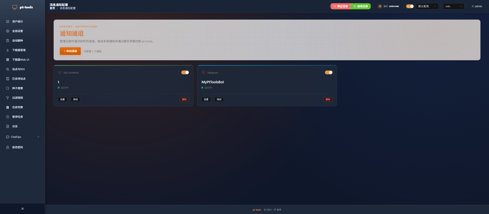
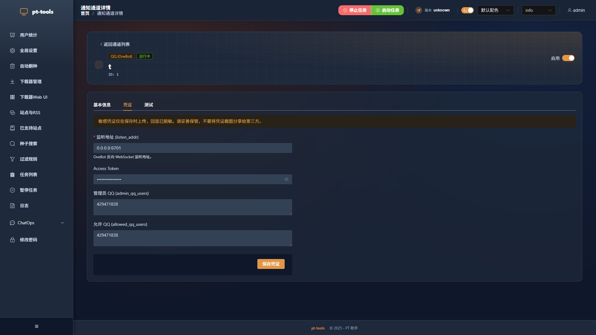
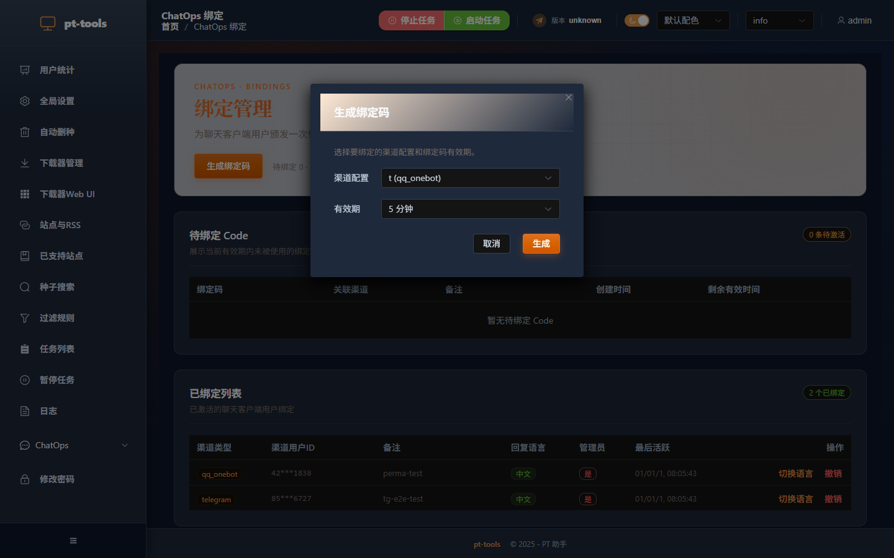

# QQ OneBot (NapCat) 配置指南

本文介绍如何通过 **NapCatQQ** 将你的 QQ 账号接入 pt-tools，实现私聊命令控制和系统通知推送。

---

## 1. 前置条件

- 一个用于做 bot 的 **QQ 小号**（强烈不建议用主力号，存在被风控的风险）
- 安装了 **Docker** 的机器（可以是运行 pt-tools 的同一台，也可以是别的机器，但两台需要网络互通）
- pt-tools 服务已经在运行，Web UI 可以正常访问

> [!WARNING]
> QQ 协议桥（NapCat / LLOneBot 等）属于第三方社区方案，存在账号被 QQ 风控封禁的风险。请使用专用小号，不要用日常主力 QQ。

---

## 2. NapCat 部署（Docker）

### 快速启动

在终端执行下面的命令，把 NapCat 容器跑起来：

```bash
docker run -d \
  --name napcat \
  --restart always \
  -e NAPCAT_UID=$(id -u) \
  -e NAPCAT_GID=$(id -g) \
  -p 3001:3001 \
  -p 6099:6099 \
  -v $(pwd)/napcat/config:/app/napcat/config \
  -v $(pwd)/ntqq:/app/.config/QQ \
  mlikiowa/napcat-docker:v4.18.1
```

参数说明：

| 参数                               | 说明                                                          |
| ---------------------------------- | ------------------------------------------------------------- |
| `NAPCAT_UID` / `NAPCAT_GID`        | 以当前用户身份运行，避免挂载目录权限问题                      |
| `-p 3001:3001`                     | QQ 协议端口（NapCat 内部通信用）                              |
| `-p 6099:6099`                     | NapCat WebUI 端口，浏览器通过此端口管理                       |
| `napcat/config:/app/napcat/config` | 持久化 NapCat 自身配置（网络配置、token 等）                  |
| `ntqq:/app/.config/QQ`             | 持久化 QQ 登录数据（设备信息、session），重启后不需要重新扫码 |

### Docker Compose 方式

如果你更习惯 Compose 管理，把下面的内容保存为 `docker-compose.yml` 后执行 `docker compose up -d`：

```yaml
services:
  napcat:
    image: mlikiowa/napcat-docker:v4.18.1
    container_name: napcat
    restart: always
    environment:
      NAPCAT_UID: "${UID:-1000}"
      NAPCAT_GID: "${GID:-1000}"
    ports:
      - "3001:3001"
      - "6099:6099"
    volumes:
      - ./napcat/config:/app/napcat/config
      - ./ntqq:/app/.config/QQ
```

---

## 3. NapCat WebUI 首次登录

容器启动后，在浏览器访问 `http://<NapCat所在机器IP>:6099/webui`。

**首次登录 token** 在容器日志里，用下面的命令查看：

```bash
docker logs napcat | grep token
```

找到类似这样的一行：

```
[NapCat] webui token: abc123def456
```

把 token 填入登录框，点击登录。

---

## 4. QQ 账号扫码登录

登录 WebUI 后，进入「登录」页面，系统会生成一个二维码。

用作 bot 的 QQ 小号，在手机 QQ 上扫码，完成登录授权。

登录成功后，WebUI 首页会显示当前登录账号的 QQ 号和在线状态。

---

## 5. 配置反向 WebSocket

pt-tools 使用**反向 WebSocket（Reverse WS）**模式：NapCat 主动连接到 pt-tools 监听的地址，而不是 pt-tools 去连 NapCat。

在 NapCat WebUI 里：

1. 进入「网络配置」
2. 找到「WebSocket 客户端」部分
3. 点击「添加」

填写以下内容：

| 字段     | 填写值                                     | 说明                                 |
| -------- | ------------------------------------------ | ------------------------------------ |
| URL      | `ws://<pt-tools主机IP>:6701/onebot/v11/ws` | 端口和路径要与 pt-tools 配置保持一致 |
| Token    | `ptqa_2026_secret`（自定义 16+ 字符）      | 双方必须填同一个值                   |
| 消息格式 | `array`                                    | 固定选 array，pt-tools 只解析此格式  |
| 心跳间隔 | `30000`（毫秒）                            | 推荐 30s                             |
| 重连间隔 | `5000`（毫秒）                             | 推荐 5s                              |

填好后点「启用」，再保存。

---

## 6. pt-tools 端配置

打开 pt-tools Web UI，进入 ChatOps → 消息通知，点「**添加通道**」：

1. 通道类型选择 **QQ (OneBot)**，填写通道名称（任意，如 `主 QQ`，方便自己辨认），点「**创建通道**」。
2. 在通道列表中点击刚创建的通道，进入通道详情。
3. 在「**凭证与连接**」中填写下表各项，点「**保存凭证**」。保存后通道会立即用新配置重连。

| 字段                        | 填写值             | 说明                                                  |
| --------------------------- | ------------------ | ----------------------------------------------------- |
| 监听地址（listen_addr）     | `0.0.0.0:6701`     | 反向 WebSocket 的监听地址，端口与 NapCat 里配置的一致 |
| Access Token                | `ptqa_2026_secret` | 与 NapCat 里填的 token 完全一致                       |
| 管理员 QQ（admin_qq_users） | `你的QQ号`         | 逗号分隔的 QQ 号；测试消息发给其中第一个，见下方说明  |
| 允许 QQ（allowed_qq_users） | 留空               | 逗号分隔的 QQ 号；不用于过滤消息，见下方说明          |

WebSocket 路径固定为 `/onebot/v11/ws`，与 NapCat URL 中的路径一致即可。

> [!IMPORTANT]
> QQ 通道目前不按「管理员 QQ」和「允许 QQ」过滤消息，也不据此分配权限，这两个列表只用来决定测试消息发给谁。真正起作用的是绑定：只有用绑定码完成绑定的 QQ 号才能执行命令，而**每个完成绑定的账号都拥有管理员权限**，可以暂停、恢复、删除种子和管理 RSS 订阅。请只把绑定码发给你信任的账号；不再需要时，在 ChatOps → ChatOps 绑定 中撤销绑定。

保存后，通道状态先显示「运行中」（端口已开始监听），NapCat 连上之后变为「已连接」。



> Web UI → ChatOps → 消息通知，添加完成后可以看到 QQ 通道已启用



> QQ 通道详情的「凭证与连接」，可以查看和修改监听地址、Access Token 和管理员列表

---

## 7. 验证连接

NapCat 配置保存后，会自动尝试连接到 pt-tools。连接成功后，通道状态变为「已连接」，pt-tools 的运行日志（系统 → 运行日志）中会出现类似这样的一行：

```
QQ 适配器(1): [wss] 连接Websocket服务器: 172.18.0.3:41526 成功, 账号: 123456789
```

其中地址是 NapCat 一侧的地址，账号是 bot 的 QQ 号。

也可以在通道列表或通道详情中发送一条**测试消息**。如果你的手机 QQ 收到了消息，说明出站推送正常。

---

## 8. 绑定账号与测试命令

连接建立只是第一步。还需要把你的 QQ 号和 pt-tools 做绑定，bot 才认识你、才响应你的命令。

### 生成绑定码

在 Web UI 打开 ChatOps → ChatOps 绑定，点「**生成绑定码**」：

- 选择刚配置的 QQ 通道
- 有效期选「5 分钟」（默认）
- 点「生成」



> 生成绑定码时需要选择关联的通道和有效期（5 分钟 / 1 小时 / 1 天 / 30 天 / 永久）

绑定码会出现在「待绑定」列表里，是一个 8 字符的字符串，类似 `A3F7KP2M`。

### 在 QQ 里完成绑定

用你的**个人 QQ**（不是 bot 那个号），**私聊**发给 bot：

```
/bind A3F7KP2M
```

bot 回复「绑定成功」即表示完成。

### 测试 `/help`

绑定成功后，发送 `/help`，bot 会列出全部 13 个命令。

完成绑定的账号拥有管理员权限，可以使用 `/pause`、`/resume`、`/delete` 等管理员命令。

---

## 9. 常见问题 FAQ

### Q: pt-tools 日志显示「ECONNREFUSED」

**原因**：pt-tools 没有正确监听 6701 端口，或者防火墙把端口挡住了。

**检查**：

```bash
# 确认 pt-tools 在监听
ss -tlnp | grep 6701
# 或
netstat -tlnp | grep 6701
```

如果端口没有监听，检查通道的监听地址（`listen_addr`）是否填写正确，并确认通道已启用。

如果端口在监听但 NapCat 连不上，检查防火墙规则：

```bash
# 临时测试（CentOS/RHEL）
firewall-cmd --add-port=6701/tcp --zone=public
# Ubuntu/Debian
ufw allow 6701/tcp
```

---

### Q: NapCat 显示连上了但 bot 不响应命令

**原因一**：你的 QQ 号尚未完成绑定，bot 不认识你。先执行第 8 节的绑定流程。

**原因二**：可能碰到了 WebSocket 半死的问题（连接存在但消息不通）。pt-tools 每 30 秒发送一次 ping，90 秒内收不到任何数据会主动断开，让 NapCat 重连；ChatOps 从 v0.31.0 起正式发布，正式版本都包含这一机制。如果你用的是更早的测试构建，请升级到最新版本。

---

### Q: 发了命令 bot 没有任何反应，连 DENIED 也没有

**原因**：ChatOps 正式发布（v0.31.0）之前的测试构建中存在读取循环死锁，正式版本已修复。请升级到最新版本。

---

### Q: 日志出现「bot 被移出群」之类的错误

**原因**：ChatOps 正式发布（v0.31.0）之前的测试构建会把私聊消息误识别为群消息，进而判断「机器人被移出了这个群」。正式版本已修复，请升级到最新版本。

---

### Q: `admin_qq_users` 和 `allowed_qq_users` 有什么区别？

QQ 通道目前不按这两个列表过滤消息，也不据此分配管理员权限。它们只用于测试消息：测试消息发给第一个管理员 QQ；没有填写时发给第一个允许 QQ；两者都没填时，发给第一个完成绑定的账号。

- 没有绑定的 QQ 号发来命令时，bot 回复「请先 /bind <绑定码> 完成绑定」，不会执行命令。
- 完成绑定的 QQ 号可以执行全部命令，包括管理员命令。

所以控制谁能操作 pt-tools 的方法是控制绑定码：只发给信任的账号，并及时撤销不再需要的绑定。

---

## 10. 进阶配置

### 使用 docker-compose.yml 配合 pt-tools 一起编排

```yaml
services:
  pt-tools:
    image: sunerpy/pt-tools:latest
    container_name: pt-tools
    environment:
      PT_HOST: "0.0.0.0"
      PT_PORT: "8080"
      TZ: "Asia/Shanghai"
    ports:
      - "8080:8080"
      - "6701:6701" # QQ OneBot 反向 WS 端口
    volumes:
      - ./data:/app/.pt-tools
    restart: unless-stopped

  napcat:
    image: mlikiowa/napcat-docker:v4.18.1
    container_name: napcat
    restart: always
    environment:
      NAPCAT_UID: "${UID:-1000}"
      NAPCAT_GID: "${GID:-1000}"
    ports:
      - "6099:6099"
    volumes:
      - ./napcat/config:/app/napcat/config
      - ./ntqq:/app/.config/QQ
    depends_on:
      - pt-tools
```

在这个场景里，NapCat 的 WebSocket URL 填 `ws://pt-tools:6701/onebot/v11/ws`（用 Docker 内网 DNS）。

---

### systemd 守护 NapCat（非 Docker）

如果你不用 Docker，可以把 NapCat 配成 systemd 服务：

```ini
[Unit]
Description=NapCatQQ
After=network.target

[Service]
Type=simple
User=your-user
WorkingDirectory=/opt/napcat
ExecStart=/opt/napcat/napcat.sh
Restart=on-failure
RestartSec=10

[Install]
WantedBy=multi-user.target
```

---

### Caddy 反代 WebSocket

如果 pt-tools 在内网且你需要通过外网的 NapCat 连接，可以用 Caddy 做 HTTPS/WSS 反代：

```caddyfile
ws.your-domain.com {
    reverse_proxy /onebot/v11/ws localhost:6701
}
```

NapCat 侧 URL 改为 `wss://ws.your-domain.com/onebot/v11/ws`，同时建议配合 access_token 鉴权。

---

### 心跳调优

如果网络质量较差，可以调低心跳间隔（加快检测断线）：

- NapCat `heartInterval`：15000（15 秒）
- NapCat `reconnectInterval`：3000（3 秒）

pt-tools 每 30 秒发送一次 ping；如果 90 秒内收不到任何数据（包括 NapCat 的心跳和 pong），会主动关闭连接，触发 NapCat 重连。
