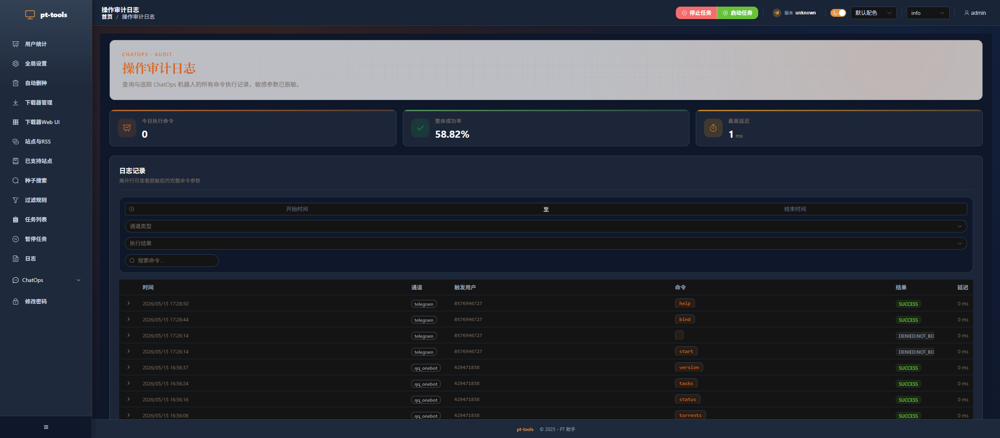

# ChatOps 快速开始

[返回首页](../../README.md)

pt-tools 内置了一套 ChatOps 层，让你可以通过 **QQ 私聊** 或 **Telegram 私聊** 随时查看下载状态、控制任务、接收事件通知，不需要打开浏览器。

---

## 目录

- [简介](#简介)
- [支持的通道](#支持的通道)
- [选择哪个通道？](#选择哪个通道)
- [内置命令清单](#内置命令清单)
- [开始配置](#开始配置)

---

## 简介

ChatOps 的核心思路和 Hermes / MoviePilot 类似：在你熟悉的 IM 里对 bot 发一条命令，bot 调用 pt-tools 内部服务并回复结果。整个交互都在私聊里发生，不需要暴露 Web UI 端口。

功能亮点：

- **11 个内置命令**，覆盖状态查询、种子控制、任务管理
- **管理员白名单**，陌生人发的命令全部静默丢弃
- **绑定码机制**，8 字符一次性码，5 分钟 TTL，通过 Web UI 生成再发给需要绑定的用户
- **操作审计**，每条命令的执行结果、延迟、触发用户全部记录到 `action_audit` 表
- **AES-GCM 加密落库**，Bot Token / Access Token 等凭证加密存储，截图不泄漏明文
- **出站推送**，除命令回复外，还能把系统事件（种子推送成功、磁盘告警等）主动推送到 IM

---

## 支持的通道

| 通道 | 协议 | 入站命令 | 出站推送 | 推荐场景 |
|------|------|:--------:|:--------:|----------|
| **QQ OneBot** | OneBot v11 反向 WebSocket | ✅ | ✅ | 国内用户、日常 QQ 就是主要 IM |
| **Telegram** | Bot API 长轮询 | ✅ | ✅ | 海外用户、需要对接外网通知 |
| **企业微信群机器人** | 企业微信 Webhook | ❌ | ✅ | 仅用于出站推送（组内告警） |
| **通用 Webhook** | HMAC-SHA256 HTTP | ❌ | ✅ | 自定义集成、接入 n8n / Zapier 等 |

> 入站命令（IM→pt-tools）需要双向连接，Webhook 类通道只支持单向出站推送。

---

## 选择哪个通道？

```
需要在 IM 里发命令控制 pt-tools？
│
├── 是 → 国内用 QQ 作为主要 IM？
│        ├── 是 → QQ OneBot (NapCat)  →  docs/guide/chatops-qq-napcat.md
│        └── 否 → 能访问 Telegram？
│                  ├── 是 → Telegram Bot  →  docs/guide/chatops-telegram.md
│                  └── 否 → 挂代理后再用 Telegram
│
└── 只需要出站通知（事件推送到群）？
     ├── 企业微信群 → 配置 WeCom Webhook
     └── 自定义系统 → 配置 Generic Webhook
```

---

## 内置命令清单

所有命令均以 `/` 开头，在私聊窗口发送。命令不区分大小写。

| 命令 | Command (EN) | 说明 | 权限 |
|------|-------------|------|------|
| `/help` | `/help` | 列出所有可用命令及用法 | 普通 |
| `/status` | `/status` | 系统运行状态：速度、磁盘、活跃任务数 | 普通 |
| `/version` | `/version` | 当前版本及最新可用版本 | 普通 |
| `/tasks` | `/tasks` | RSS 任务列表及运行状态 | 普通 |
| `/sites` | `/sites` | 已配置站点摘要（名称、类型） | 普通 |
| `/torrents` | `/torrents` | 按下载器分页列出种子 | 普通 |
| `/pause <hash>` | `/pause <hash>` | 暂停指定种子（支持 hash 前缀） | 管理员 |
| `/resume <hash>` | `/resume <hash>` | 恢复指定种子 | 管理员 |
| `/delete <hash>` | `/delete <hash>` | 删除种子（带二次确认） | 管理员 |
| `/bind <code>` | `/bind <code>` | 凭 8 字符绑定码将当前账号绑定到 pt-tools | 任何人 |
| `/unbind` | `/unbind` | 解除当前账号的绑定 | 普通 |

> **速率限制**：默认每用户每分钟最多 10 条命令，超出后静默丢弃（不回复错误，防止信息泄露）。

---

## 开始配置

根据你选择的通道，继续阅读对应的详细指南：

- **QQ (NapCat)** → [chatops-qq-napcat.md](chatops-qq-napcat.md)
- **Telegram** → [chatops-telegram.md](chatops-telegram.md)

配置完成后，建议访问 Web UI 的审计日志页面（`/chatops/audit`）确认命令正常执行并被记录。


> Web UI → ChatOps → 通知通道，可以看到已配置的 QQ 和 Telegram 通道


> Web UI → ChatOps → 审计日志，展示今日命令数、成功率和最近记录

---

## RSS 上新通知

通道配好后，你还可以让 pt-tools 在 RSS 拉到新种时主动推送给你：

- **all 模式**：任何上新都告诉你（仅用 feed 字段，无额外站点请求）
- **filtered 模式**：仅在过滤规则命中时通知（适合追剧 / 挑蓝光）
- **both 模式**：两路都开，filtered 命中时自动 supersede 同种子的 all 通知

支持静默时段（HH:MM 跨午夜）、30s digest 合并、指数退避重试、Telegram 内联按钮（立即下载 / 忽略）等。

详见 → **[RSS 上新通知](chatops-rss-notify.md)**
